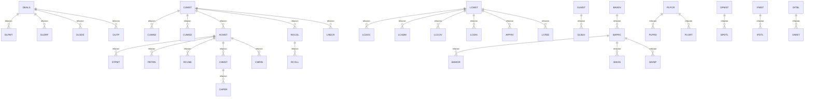

# Estructura de Base de Datos Propuesta

## Alcance
- Se listan las tablas/archivos y su clave funcional reportada en la guía.
- En esta sección no se detallan tipos de dato ni longitudes por campo.

## Resumen
- Total de tablas identificadas: **114**
- Total de módulos funcionales: **15**

| Módulo | # Tablas |
|---|---:|
| 1. ARCHIVOS COMUNES | 27 |
| 2. CLIENTES | 5 |
| 3. CUENTAS DE DETALLE/CHEQUERAS | 18 |
| 4. CONTRATOS/CERTIFICADOS/GIROS/VALORES AL COBRO | 9 |
| 5. CARTAS DE CRÉDITO | 10 |
| 6. COBRANZAS | 4 |
| 7. CONTABILIDAD | 9 |
| 8. GARANTÍAS | 2 |
| 9. LINEAS DE CRÉDITO | 1 |
| 10. ACTIVOS FIJOS | 4 |
| 11. PROVEEDORES Y CUENTAS POR PAGAR | 7 |
| 12. PAGOS Y TRANSFERENCIAS | 6 |
| 13. PROPUESTA DE CRÉDITO | 9 |
| 14. MANEJO DE DOCUMENTOS | 2 |
| 15. SEGURIDAD | 1 |

## Tablas por módulo

### 1. ARCHIVOS COMUNES
| Tabla | Descripción | Clave reportada |
|---|---|---|
| `CNOFT` | Archivo Maestro de Tablas de Datos Comunes. | Código de la Tabla, Idioma |
| `CNOFC` | Archivo de Referencias del Sistema o de Datos Comunes. | Código de la Tabla, Código del Registro |
| `MLNCT` | Archivo de patrones/formatos de Notificaciones a Clientes (Usos) | Banco, Código de Notificación, Nivel, Idioma y Secuencia. |
| `MLNOT` | Archivo que contiene los datos a imprimir en la notificación (Usos) | Banco, Fecha de Proceso, Cuenta, Código de Notificación y Nivel. |
| `HSNOT` | Histórico de Datos impresos en las Notificaciones | Banco, Fecha de Proceso, Cuenta, Código de Notificación y Nivel. |
| `HEAD` | Archivo títulos de reportes | Nombre del Printer File, Secuencia |
| `MSSGS` | Archivo mensajes de Errores. | No tiene clave. |
| `HOLYD` | Archivo de Feriados. | Moneda, Fecha |
| `APCLS` | Archivo Maestro de Productos. | Código de Banco, Código de Producto |
| `RATES` | Archivos de Tasas de Cambio (Posición / Contra Valor) | Código de Banco, Código de Moneda |
| `RTRNS` | Historia de Tasas de Cambio. | Código de Banco, Moneda, Fecha |
| `HLHIS` | Archivo histórico de Cambios en Retenciones. | No tiene clave. |
| `PRENA` | Archivo de Descripciones de Programas en Inglés. | Nombre del Programa |
| `PRENS` | Archivo de Descripciones de Programas en Español. | Nombre del Programa |
| `UT500` | Agenda Personalizada | Código de Usuario, Fecha |
| `UT510` | Mensajes de Usuarios. | Código de Usuario, Fecha |
| `MICRF` | Archivo que contiene los reportes salvados en Microficha. | Tipo de Formulario, Nombre del Reporte, Secuencia. |
| `IBSDD` | Diccionario de Datos del IBS | No tiene clave |
| `IBTBL` | Archivo de Referencias Cruzadas para manejo de Intersucursales. | No especificada en documento |
| `TRANS` | Archivo histórico de transacciones | No especificada en documento |
| `TRDSC` | Descripciones Adicionales a las Transacciones (TRANS). | Número de Registro Relativo, Secuencia |
| `TTRAN` | Archivo Maestro de Transacciones del día. | Banco, Sucursal, Moneda, Cuenta Contable, Cuenta, Fecha |
| `CIFXF` | Relación de operaciones con clientes. | No tiene clave |
| `CNTRLCNT` | Parámetros Generales del Sistema | Código de Banco |
| `CNTRLBRN` | Archivo de Sucursales | Código de Banco, Código de Sucursal |
| `CNTRLNUM` | Control de Numeración Automática de Operaciones. | Código de Aplicación, Tipo de Cuenta. |
| `CNTRLTAX` | Definiciones para el manejo de cobro de impuestos. | Código de Banco, Código de Impuesto. |

### 2. CLIENTES
| Tabla | Descripción | Clave reportada |
|---|---|---|
| `CUMST` | Archivo de Maestro de Clientes | Número del Cliente o Identificación del Cliente |
| `CUMAD` | Archivo de Direcciones de Correo y Beneficiarios de Operaciones/Clientes. | Número del Cliente/Operación, Tipo de Registro, Secuencia. |
| `CUMPR` | Archivo Maestro de Palabras Reservadas que se omiten en Búsqueda de Clientes por String de Caracteres. | Palabra |
| `CUMSD` | Archivo Maestro de Clientes para búsqueda de Clientes a través de un String de Caracteres. | Cliente. |
| `SPINS` | Archivo de Instrucciones especiales (Usos) | Tipo de Información, Cuenta/Cliente , Secuencia |

### 3. CUENTAS DE DETALLE/CHEQUERAS
| Tabla | Descripción | Clave reportada |
|---|---|---|
| `ACMST` | Archivo Maestro de Cuentas de Detalle | No tiene clave. |
| `STPMT` | Ordenes de No Pago de Cheques | Banco, Sucursal, Moneda, Cuenta Contable, Cuenta, Secuencia |
| `UNCOL` | Maestro de Retenciones | Banco, Sucursal, Cuenta |
| `PBTRN` | Transacciones de Libretas de Ahorro | Cuenta, Fecha, Hora |
| `OFMST` | Maestro de Cheques Certificados y Cheques de Gerencia. | Banco, Sucursal, Numero de Cheque. |
| `RCLNB` | Transacciones de Cuentas Reconciliables | Banco, Sucursal, Moneda, Cuenta Contable, Cuenta, Fecha |
| `TLMST` | Maestro de Cajeros | Código de Cajero, Moneda |
| `TDRCR` | Maestro de Transacciones de Cajero | Código de Transacción. |
| `AUDIT` | Detalle diario de transacciones de caja. | Banco, Sucursal, Cajero, Moneda, Referencia. |
| `CHMST` | Maestro de Chequeras. | Banco, Sucursal, Moneda, Cuenta, Cheque Inicial. |
| `CHPER` | Personalizacion de Chequeras. | Banco, Sucursal, Cuenta. |
| `CHSTS` | Maestro de cambio de estatus a cuentas de detalle. | Banco, Sucursal, Moneda, Cuenta Contable, Cuenta. |
| `DEVOL` | Detalle de Cheques devueltos. | Cuenta, Número de Cheque. |
| `CMRIN` | Detalle de Cámara Entrante. | Banco, Sucursal. Moneda, Cuenta, Monto |
| `OVDRF` | Archivo diario de Sobregiros. | No tiene clave. |
| `CNTRLMSG` | Mensajes a ser impresos en estados de cuenta. | Banco |
| `CNTRLRTE` | Tabla de Tasas y Cargos por Servicio en Cuentas de Detalle. | Banco, Tipo de Producto, Código de Tabla. |
| `CNTRLDEV` | Definición de las Causales de Devolución de Cheques. | Código de Causal. |

### 4. CONTRATOS/CERTIFICADOS/GIROS/VALORES AL COBRO
| Tabla | Descripción | Clave reportada |
|---|---|---|
| `DEALS` | Maestro de Préstamos, Certificados, Giros, Valores al Cobro, Inversiones. | No tiene clave. |
| `DLPMT` | Plan de Pagos | Banco, Sucursal, Moneda, Préstamo, Fecha, Tipo de Registro. |
| `DLDRF` | Detalle de Giros y Valores al Cobro. | Banco, Sucursal, Moneda, Préstamo, Identificación, Número de Documento |
| `DLSDE` | Detalle de Deducciones del Plan de Pagos | Préstamo, Fecha, Tipo, Secuencia, Código de Deducción. |
| `DLCLP` | Calificación y Previsión de Cartera. | Cliente, Cuenta, Referencia. |
| `DDCPN` | Transacciones pendientes de Cobro. | Préstamo |
| `DLITP` | Maestro de Deducciones de Préstamos. | Préstamo, Código de Deducción |
| `CDRTE` | Tabla de Tasas de Depósitos | Número de Tabla, Fecha, Moneda. |
| `CNTRLDLS` | Tabla de Tasas para control de Préstamos. | Banco, Número de Tabla, Tipo de Producto. |

### 5. CARTAS DE CRÉDITO
| Tabla | Descripción | Clave reportada |
|---|---|---|
| `LCMST` | Maestro de Cartas de Crédito. | No tiene clave. |
| `LCDOC` | Documentos de Cartas de Crédito | Número de Carta Crédito, Tipo, Banco, Código de Documento, Número de Línea. |
| `LCFIN` | Indice de Formatos de Cartas de Crédito | Nivel, Código de Documento, Secuencia de Texto |
| `LCFMT` | Formatos de Cartas de Crédito | Código de Documento, Secuencia de Texto, Número de Línea |
| `LCADM` | Enmiendas a Cartas de Crédito | Número Carta de Crédito, Número de Enmienda. |
| `LCCOV` | Negociaciones de Cartas de Crédito | Número Carta de Crédito, Secuencia. |
| `LCDIN` | Documentos Recibidos en Cartas de Crédito | Número Carta de Crédito, Secuencia. |
| `LCSTA` | Estadística de Aperturas, Enmiendas, Pagos en Cartas de Crédito | No tiene clave. |
| `CNTRLLCP` | Archivo de Control de Cartas de Crédito | Banco, ?LCRPARM? |
| `CNTRLRLC` | Tabla de Cargos por Servicios o Tarifas de Cartas de Crédito. | Banco, Tipo de Producto, Número de Tabla. |

### 6. COBRANZAS
| Tabla | Descripción | Clave reportada |
|---|---|---|
| `DCMST` | Maestro de Cobranzas Documentarias. | No tiene clave. |
| `APPRV` | Cobranzas pendientes de Aprobación. | Número de Carta Crédito, Tipo. |
| `LCFEE` | Control de Cobro de Comisiones | Número de Carta Crédito, Código de Comisión. |
| `CNTRLRCO` | Tabla de Cargos por Servicios o Tarifas de Cobranzas. | Banco, Tipo de Producto, Número de Tabla. |

### 7. CONTABILIDAD
| Tabla | Descripción | Clave reportada |
|---|---|---|
| `GLMST` | Maestro de Cuentas Contables. | Código de Banco, Moneda, Cuenta Contable |
| `INPUT` | Archivo de Asientos Contables Aprobados (Archivos Derivados). | Número del Lote y secuencia dentro del lote |
| `GLBLN` | Balances Generales | Banco, Sucursal, Moneda, Cuenta Contable |
| `GLBSE` | Balances Generales Consolidado. | No tiene clave. |
| `GLFIN` | Estados Financieros por niveles. | No tiene clave. |
| `CCDSC` | Maestros de Centros de Costos | No especificada en documento |
| `INPT2` | Entradas Contables Automáticas generadas en el fin de día. | No tiene clave. |
| `NXINP` | Transacciones Contables del próximo día. | Número de Batch, Secuencia. |
| `BUMST` | Maestro de Presupuestos | Banco, Sucursal, Moneda, Número de Presupuesto, Centro de Costo. |

### 8. GARANTÍAS
| Tabla | Descripción | Clave reportada |
|---|---|---|
| `ROCOL` | Maestro de Garantías | Banco, Cliente, Número de Garantía. |
| `RCOLL` | Relaciones entre Garantías | Banco, Cuenta a Garantizar, Cuenta que Garantiza. |

### 9. LINEAS DE CRÉDITO
| Tabla | Descripción | Clave reportada |
|---|---|---|
| `LNECR` | Maestro de Lineas de Crédito | Cliente, Número de Línea. |

### 10. ACTIVOS FIJOS
| Tabla | Descripción | Clave reportada |
|---|---|---|
| `FIXMS` | Maestro de Activos Fijos | Número de Activo. |
| `CLSMS` | Maestro de Clases de Amortizaciones de Activos Fijos | Código de Clase. |
| `LOCMS` | Maestro de Localizaciones de Activos Fijos | Número de Localización. |
| `CNTRLFIX` | Archivo de Control de Activos Fijos. | Banco. |

### 11. PROVEEDORES Y CUENTAS POR PAGAR
| Tabla | Descripción | Clave reportada |
|---|---|---|
| `BAVEN` | Maestro de Proveedores. | Número de Proveedor. |
| `BAPRC` | Maestro de Cuentas por Pagar | Banco, Sucursal, Origen de la Cuenta, Tipo de Cuenta, Cliente, Número de Referencia, Tipo de Registro. |
| `BAMOR` | Amortizaciones de Cuentas por Pagar | Banco, Sucursal, Origen de la Cuenta, Tipo de Cuenta, Cliente, Número de Referencia, Tipo de Registro. |
| `BAINP` | Transacciones Contables Diarias de Cuentas por Pagar | Número de Batch, Secuencia. |
| `BAHIS` | Histórico de Cuentas por Pagar | Banco, Origen de la Cuenta, Tipo de Cuenta, Cliente, Número de Referencia, Fecha. |
| `CNTRLBAF` | Archivo de Control de Cuentas por Pagar (Sección Comisiones). | Banco, Moneda. |
| `CNTRLBAP` | Archivo de Control de Cuentas por Pagar (Otros Parámetros). | Banco, Moneda. |

### 12. PAGOS Y TRANSFERENCIAS
| Tabla | Descripción | Clave reportada |
|---|---|---|
| `FIWRT` | Transacciones Históricas de Pagos y Recibos. | Banco, Número de Transferencia. |
| `POFED` | Ordenes de Pago. | Banco, Moneda, Cliente, Tipo, Cuenta, Número de Referencia. |
| `POSWF` | Ordenes de Pago vía Swift. | Banco, Moneda, Cliente, Tipo, Cuenta, Número de Referencia, Monto. |
| `POTLX` | Ordenes de Pago vía Télex. | Banco, Moneda, Cliente, Tipo, Cuenta, Número de Referencia. |
| `SWITF` | Histórico de Pagos y Recibidos vía Swift. | Banco, Número de Referencia, Formato Swift. |
| `CNTRLPRF` | Archivo de Control de Pagos y Recibos. | Banco, ?PAR?, Código de Tabla |

### 13. PROPUESTA DE CRÉDITO
| Tabla | Descripción | Clave reportada |
|---|---|---|
| `PLPCR` | Propuestas de Crédito | Numero de Propuesta. |
| `PLPRD` | Detalle de Productos asociados a una propuesta. | Numero de Propuesta, Producto, Tipo de Producto. |
| `PLGRT` | Garantías asociadas a las propuestas de crédito. | Numero de Propuesta, Secuencia. |
| `DPMST` | Cabecera de la Declaración Patrimonial de Personas Naturales. | Cliente, Secuencia. |
| `DPDTL` | Detalle de la Declaración Patrimonial de Personas Naturales. | Cliente, Secuencia, Tipo de Registro. |
| `IFMST` | Cabecera de Declaración Patrimonial de Personas Jurídicas. | Cliente, Año, Mes, Formato de Balance. |
| `IFDTL` | Detalle de Declaración Patrimonial de Personas Jurídicas. | Cliente, Año, Mes, Formato de Balance, Código de Línea, Código de Cuenta. |
| `DPGLN` | Plan de Cuentas de nuestros Clientes. | Tipo de Balance, Código de Cuenta |
| `LIMST` | Cabecera de Declaración Legal de Personas Jurídicas. | Cliente. |

### 14. MANEJO DE DOCUMENTOS
| Tabla | Descripción | Clave reportada |
|---|---|---|
| `DIMST` | Maestro de Inventario de Documentos | Tipo de Cuenta, Número de Tabla, Secuencia |
| `DITBL` | Tablas de Tipos de Documentos. | Número de Tabla, Secuencia. |

### 15. SEGURIDAD
| Tabla | Descripción | Clave reportada |
|---|---|---|
| `USERS` | Archivo de Autorizaciones por menús | Código de Usuario, Menú, Opción. |

## Diagrama de BD (vista conceptual)

```mermaid
erDiagram
    CUMST ||--o{ CUMAD : tiene
    CUMST ||--o{ CUMSD : indice_busqueda
    CUMST ||--o{ SPINS : instrucciones
    CUMST ||--o{ ACMST : cliente_cuenta
    ACMST ||--o{ STPMT : ordenes_no_pago
    ACMST ||--o{ PBTRN : tx_libreta
    ACMST ||--o{ RCLNB : tx_reconciliables
    ACMST ||--o{ CHMST : chequeras
    CHMST ||--o{ CHPER : personalizacion
    ACMST ||--o{ CMRIN : camara_entrante
    CUMST ||--o{ DEALS : contratos
    DEALS ||--o{ DLPMT : plan_pagos
    DEALS ||--o{ DLDRF : giros_valores
    DEALS ||--o{ DLSDE : deducciones_plan
    DEALS ||--o{ DLITP : deducciones_maestro
    LCMST ||--o{ LCDOC : documentos
    LCMST ||--o{ LCADM : enmiendas
    LCMST ||--o{ LCCOV : negociaciones
    LCMST ||--o{ LCDIN : documentos_recibidos
    LCMST ||--o{ APPRV : pend_aprobacion
    LCMST ||--o{ LCFEE : comisiones
    GLMST ||--o{ GLBLN : balances
    GLMST ||--o{ INPUT : asientos
    GLMST ||--o{ INPT2 : asientos_auto
    GLMST ||--o{ NXINP : prox_dia
    CUMST ||--o{ LNECR : lineas_credito
    CUMST ||--o{ ROCOL : garantias
    ROCOL ||--o{ RCOLL : relaciones
    BAVEN ||--o{ BAPRC : cxp
    BAPRC ||--o{ BAMOR : amortizaciones
    BAPRC ||--o{ BAHIS : historico
    BAPRC ||--o{ BAINP : tx_diarias
    PLPCR ||--o{ PLPRD : detalle_productos
    PLPCR ||--o{ PLGRT : garantias
    DPMST ||--o{ DPDTL : detalle_pn
    IFMST ||--o{ IFDTL : detalle_pj
    DIMST ||--o{ DITBL : tipos_documento
```

## Notas
- Para tablas con clave "No tiene clave", en implementación SQL conviene agregar `id` surrogate e índices por campos de consulta.
- Para diseño físico final, falta mapear tipos/longitudes desde un diccionario de datos detallado por campo.

## Diccionario de tablas normalizado (enriquecido)

Esta version amplia cada tabla con campos funcionales y operativos para facilitar el diseno fisico de la BD.

Criterios usados:
- PK basada en la clave funcional reportada; cuando no existe, se propone `id` tecnico.
- FK propuestas segun relaciones funcionales del documento y flujo transaccional.
- Se agregan campos de auditoria, control de version y observaciones en todas las tablas.

### 1. ARCHIVOS COMUNES

#### CNOFT
Descripcion: Archivo Maestro de Tablas de Datos Comunes.

| Campo | Tipo | Tamaño | PK | FK | Referencia |
|---|---|---:|:---:|:---:|---|
| codigo_tabla | VARCHAR | 20 | SI | NO | - |
| idioma | VARCHAR | 20 | SI | NO | - |
| descripcion | VARCHAR | 120 | NO | NO | - |
| valor_texto | VARCHAR | 50 | NO | NO | - |
| valor_numerico | DECIMAL | 18,2 | NO | NO | - |
| vigencia_desde | DATE | - | NO | NO | - |
| vigencia_hasta | DATE | - | NO | NO | - |
| orden_visualizacion | INT | - | NO | NO | - |
| usuario_creacion | VARCHAR | 30 | NO | NO | - |
| usuario_actualizacion | VARCHAR | 30 | NO | NO | - |
| version_registro | INT | - | NO | NO | - |
| observaciones | VARCHAR | 120 | NO | NO | - |
| estado_registro | CHAR | 1 | NO | NO | - |
| created_at | TIMESTAMP | - | NO | NO | - |
| updated_at | TIMESTAMP | - | NO | NO | - |

Indices sugeridos:
- `idx_cnoft_pk`: (codigo_tabla, idioma)
- `idx_cnoft_created_at`: (created_at)

#### CNOFC
Descripcion: Archivo de Referencias del Sistema o de Datos Comunes.

| Campo | Tipo | Tamaño | PK | FK | Referencia |
|---|---|---:|:---:|:---:|---|
| codigo_tabla | VARCHAR | 20 | SI | NO | - |
| codigo_registro | VARCHAR | 20 | SI | NO | - |
| descripcion | VARCHAR | 120 | NO | NO | - |
| valor_texto | VARCHAR | 50 | NO | NO | - |
| valor_numerico | DECIMAL | 18,2 | NO | NO | - |
| vigencia_desde | DATE | - | NO | NO | - |
| vigencia_hasta | DATE | - | NO | NO | - |
| orden_visualizacion | INT | - | NO | NO | - |
| usuario_creacion | VARCHAR | 30 | NO | NO | - |
| usuario_actualizacion | VARCHAR | 30 | NO | NO | - |
| version_registro | INT | - | NO | NO | - |
| observaciones | VARCHAR | 120 | NO | NO | - |
| estado_registro | CHAR | 1 | NO | NO | - |
| created_at | TIMESTAMP | - | NO | NO | - |
| updated_at | TIMESTAMP | - | NO | NO | - |

Indices sugeridos:
- `idx_cnofc_pk`: (codigo_tabla, codigo_registro)
- `idx_cnofc_created_at`: (created_at)

#### MLNCT
Descripcion: Archivo de patrones/formatos de Notificaciones a Clientes (Usos)

| Campo | Tipo | Tamaño | PK | FK | Referencia |
|---|---|---:|:---:|:---:|---|
| codigo_banco | VARCHAR | 20 | SI | NO | - |
| codigo_de_notificacion | VARCHAR | 20 | SI | NO | - |
| nivel | INT | - | SI | NO | - |
| idioma | VARCHAR | 20 | SI | NO | - |
| secuencia | INT | - | SI | NO | - |
| descripcion | VARCHAR | 120 | NO | NO | - |
| valor_texto | VARCHAR | 50 | NO | NO | - |
| valor_numerico | DECIMAL | 18,2 | NO | NO | - |
| vigencia_desde | DATE | - | NO | NO | - |
| vigencia_hasta | DATE | - | NO | NO | - |
| orden_visualizacion | INT | - | NO | NO | - |
| usuario_creacion | VARCHAR | 30 | NO | NO | - |
| usuario_actualizacion | VARCHAR | 30 | NO | NO | - |
| version_registro | INT | - | NO | NO | - |
| observaciones | VARCHAR | 120 | NO | NO | - |
| estado_registro | CHAR | 1 | NO | NO | - |
| created_at | TIMESTAMP | - | NO | NO | - |
| updated_at | TIMESTAMP | - | NO | NO | - |

Indices sugeridos:
- `idx_mlnct_pk`: (codigo_banco, codigo_de_notificacion)
- `idx_mlnct_created_at`: (created_at)

#### MLNOT
Descripcion: Archivo que contiene los datos a imprimir en la notificación (Usos)

| Campo | Tipo | Tamaño | PK | FK | Referencia |
|---|---|---:|:---:|:---:|---|
| codigo_banco | VARCHAR | 20 | SI | NO | - |
| fecha_proceso | DATE | - | SI | NO | - |
| numero_cuenta | VARCHAR | 24 | SI | NO | - |
| codigo_de_notificacion | VARCHAR | 20 | SI | NO | - |
| nivel | INT | - | SI | NO | - |
| descripcion | VARCHAR | 120 | NO | NO | - |
| valor_texto | VARCHAR | 50 | NO | NO | - |
| valor_numerico | DECIMAL | 18,2 | NO | NO | - |
| vigencia_desde | DATE | - | NO | NO | - |
| vigencia_hasta | DATE | - | NO | NO | - |
| orden_visualizacion | INT | - | NO | NO | - |
| usuario_creacion | VARCHAR | 30 | NO | NO | - |
| usuario_actualizacion | VARCHAR | 30 | NO | NO | - |
| version_registro | INT | - | NO | NO | - |
| observaciones | VARCHAR | 120 | NO | NO | - |
| estado_registro | CHAR | 1 | NO | NO | - |
| created_at | TIMESTAMP | - | NO | NO | - |
| updated_at | TIMESTAMP | - | NO | NO | - |

Indices sugeridos:
- `idx_mlnot_pk`: (codigo_banco, fecha_proceso)
- `idx_mlnot_fecha`: (fecha_proceso)

#### HSNOT
Descripcion: Histórico de Datos impresos en las Notificaciones

| Campo | Tipo | Tamaño | PK | FK | Referencia |
|---|---|---:|:---:|:---:|---|
| codigo_banco | VARCHAR | 20 | SI | NO | - |
| fecha_proceso | DATE | - | SI | NO | - |
| numero_cuenta | VARCHAR | 24 | SI | NO | - |
| codigo_de_notificacion | VARCHAR | 20 | SI | NO | - |
| nivel | INT | - | SI | NO | - |
| descripcion | VARCHAR | 120 | NO | NO | - |
| valor_texto | VARCHAR | 50 | NO | NO | - |
| valor_numerico | DECIMAL | 18,2 | NO | NO | - |
| vigencia_desde | DATE | - | NO | NO | - |
| vigencia_hasta | DATE | - | NO | NO | - |
| orden_visualizacion | INT | - | NO | NO | - |
| usuario_creacion | VARCHAR | 30 | NO | NO | - |
| usuario_actualizacion | VARCHAR | 30 | NO | NO | - |
| version_registro | INT | - | NO | NO | - |
| observaciones | VARCHAR | 120 | NO | NO | - |
| estado_registro | CHAR | 1 | NO | NO | - |
| created_at | TIMESTAMP | - | NO | NO | - |
| updated_at | TIMESTAMP | - | NO | NO | - |

Indices sugeridos:
- `idx_hsnot_pk`: (codigo_banco, fecha_proceso)
- `idx_hsnot_fecha`: (fecha_proceso)

#### HEAD
Descripcion: Archivo títulos de reportes

| Campo | Tipo | Tamaño | PK | FK | Referencia |
|---|---|---:|:---:|:---:|---|
| nombre_printer_file | VARCHAR | 50 | SI | NO | - |
| secuencia | INT | - | SI | NO | - |
| descripcion | VARCHAR | 120 | NO | NO | - |
| valor_texto | VARCHAR | 50 | NO | NO | - |
| valor_numerico | DECIMAL | 18,2 | NO | NO | - |
| vigencia_desde | DATE | - | NO | NO | - |
| vigencia_hasta | DATE | - | NO | NO | - |
| orden_visualizacion | INT | - | NO | NO | - |
| usuario_creacion | VARCHAR | 30 | NO | NO | - |
| usuario_actualizacion | VARCHAR | 30 | NO | NO | - |
| version_registro | INT | - | NO | NO | - |
| observaciones | VARCHAR | 120 | NO | NO | - |
| estado_registro | CHAR | 1 | NO | NO | - |
| created_at | TIMESTAMP | - | NO | NO | - |
| updated_at | TIMESTAMP | - | NO | NO | - |

Indices sugeridos:
- `idx_head_pk`: (nombre_printer_file, secuencia)
- `idx_head_created_at`: (created_at)

#### MSSGS
Descripcion: Archivo mensajes de Errores.

| Campo | Tipo | Tamaño | PK | FK | Referencia |
|---|---|---:|:---:|:---:|---|
| id | BIGINT | - | SI | NO | - |
| descripcion | VARCHAR | 120 | NO | NO | - |
| valor_texto | VARCHAR | 50 | NO | NO | - |
| valor_numerico | DECIMAL | 18,2 | NO | NO | - |
| vigencia_desde | DATE | - | NO | NO | - |
| vigencia_hasta | DATE | - | NO | NO | - |
| orden_visualizacion | INT | - | NO | NO | - |
| usuario_creacion | VARCHAR | 30 | NO | NO | - |
| usuario_actualizacion | VARCHAR | 30 | NO | NO | - |
| version_registro | INT | - | NO | NO | - |
| observaciones | VARCHAR | 120 | NO | NO | - |
| estado_registro | CHAR | 1 | NO | NO | - |
| created_at | TIMESTAMP | - | NO | NO | - |
| updated_at | TIMESTAMP | - | NO | NO | - |

Indices sugeridos:
- `idx_mssgs_pk`: (id)
- `idx_mssgs_created_at`: (created_at)

#### HOLYD
Descripcion: Archivo de Feriados.

| Campo | Tipo | Tamaño | PK | FK | Referencia |
|---|---|---:|:---:|:---:|---|
| codigo_moneda | VARCHAR | 20 | SI | NO | - |
| fecha | DATE | - | SI | NO | - |
| descripcion | VARCHAR | 120 | NO | NO | - |
| valor_texto | VARCHAR | 50 | NO | NO | - |
| valor_numerico | DECIMAL | 18,2 | NO | NO | - |
| vigencia_desde | DATE | - | NO | NO | - |
| vigencia_hasta | DATE | - | NO | NO | - |
| orden_visualizacion | INT | - | NO | NO | - |
| usuario_creacion | VARCHAR | 30 | NO | NO | - |
| usuario_actualizacion | VARCHAR | 30 | NO | NO | - |
| version_registro | INT | - | NO | NO | - |
| observaciones | VARCHAR | 120 | NO | NO | - |
| estado_registro | CHAR | 1 | NO | NO | - |
| created_at | TIMESTAMP | - | NO | NO | - |
| updated_at | TIMESTAMP | - | NO | NO | - |

Indices sugeridos:
- `idx_holyd_pk`: (codigo_moneda, fecha)
- `idx_holyd_fecha`: (fecha)

#### APCLS
Descripcion: Archivo Maestro de Productos.

| Campo | Tipo | Tamaño | PK | FK | Referencia |
|---|---|---:|:---:|:---:|---|
| codigo_banco | VARCHAR | 20 | SI | NO | - |
| codigo_de_producto | VARCHAR | 20 | SI | NO | - |
| descripcion | VARCHAR | 120 | NO | NO | - |
| valor_texto | VARCHAR | 50 | NO | NO | - |
| valor_numerico | DECIMAL | 18,2 | NO | NO | - |
| vigencia_desde | DATE | - | NO | NO | - |
| vigencia_hasta | DATE | - | NO | NO | - |
| orden_visualizacion | INT | - | NO | NO | - |
| usuario_creacion | VARCHAR | 30 | NO | NO | - |
| usuario_actualizacion | VARCHAR | 30 | NO | NO | - |
| version_registro | INT | - | NO | NO | - |
| observaciones | VARCHAR | 120 | NO | NO | - |
| estado_registro | CHAR | 1 | NO | NO | - |
| created_at | TIMESTAMP | - | NO | NO | - |
| updated_at | TIMESTAMP | - | NO | NO | - |

Indices sugeridos:
- `idx_apcls_pk`: (codigo_banco, codigo_de_producto)
- `idx_apcls_created_at`: (created_at)

#### RATES
Descripcion: Archivos de Tasas de Cambio (Posición / Contra Valor)

| Campo | Tipo | Tamaño | PK | FK | Referencia |
|---|---|---:|:---:|:---:|---|
| codigo_banco | VARCHAR | 20 | SI | NO | - |
| codigo_moneda | VARCHAR | 20 | SI | NO | - |
| descripcion | VARCHAR | 120 | NO | NO | - |
| valor_texto | VARCHAR | 50 | NO | NO | - |
| valor_numerico | DECIMAL | 18,2 | NO | NO | - |
| vigencia_desde | DATE | - | NO | NO | - |
| vigencia_hasta | DATE | - | NO | NO | - |
| orden_visualizacion | INT | - | NO | NO | - |
| usuario_creacion | VARCHAR | 30 | NO | NO | - |
| usuario_actualizacion | VARCHAR | 30 | NO | NO | - |
| version_registro | INT | - | NO | NO | - |
| observaciones | VARCHAR | 120 | NO | NO | - |
| estado_registro | CHAR | 1 | NO | NO | - |
| created_at | TIMESTAMP | - | NO | NO | - |
| updated_at | TIMESTAMP | - | NO | NO | - |

Indices sugeridos:
- `idx_rates_pk`: (codigo_banco, codigo_moneda)
- `idx_rates_created_at`: (created_at)

#### RTRNS
Descripcion: Historia de Tasas de Cambio.

| Campo | Tipo | Tamaño | PK | FK | Referencia |
|---|---|---:|:---:|:---:|---|
| codigo_banco | VARCHAR | 20 | SI | NO | - |
| codigo_moneda | VARCHAR | 20 | SI | NO | - |
| fecha | DATE | - | SI | NO | - |
| descripcion | VARCHAR | 120 | NO | NO | - |
| valor_texto | VARCHAR | 50 | NO | NO | - |
| valor_numerico | DECIMAL | 18,2 | NO | NO | - |
| vigencia_desde | DATE | - | NO | NO | - |
| vigencia_hasta | DATE | - | NO | NO | - |
| orden_visualizacion | INT | - | NO | NO | - |
| usuario_creacion | VARCHAR | 30 | NO | NO | - |
| usuario_actualizacion | VARCHAR | 30 | NO | NO | - |
| version_registro | INT | - | NO | NO | - |
| observaciones | VARCHAR | 120 | NO | NO | - |
| estado_registro | CHAR | 1 | NO | NO | - |
| created_at | TIMESTAMP | - | NO | NO | - |
| updated_at | TIMESTAMP | - | NO | NO | - |

Indices sugeridos:
- `idx_rtrns_pk`: (codigo_banco, codigo_moneda)
- `idx_rtrns_fecha`: (fecha)

#### HLHIS
Descripcion: Archivo histórico de Cambios en Retenciones.

| Campo | Tipo | Tamaño | PK | FK | Referencia |
|---|---|---:|:---:|:---:|---|
| id | BIGINT | - | SI | NO | - |
| descripcion | VARCHAR | 120 | NO | NO | - |
| valor_texto | VARCHAR | 50 | NO | NO | - |
| valor_numerico | DECIMAL | 18,2 | NO | NO | - |
| vigencia_desde | DATE | - | NO | NO | - |
| vigencia_hasta | DATE | - | NO | NO | - |
| orden_visualizacion | INT | - | NO | NO | - |
| usuario_creacion | VARCHAR | 30 | NO | NO | - |
| usuario_actualizacion | VARCHAR | 30 | NO | NO | - |
| version_registro | INT | - | NO | NO | - |
| observaciones | VARCHAR | 120 | NO | NO | - |
| estado_registro | CHAR | 1 | NO | NO | - |
| created_at | TIMESTAMP | - | NO | NO | - |
| updated_at | TIMESTAMP | - | NO | NO | - |

Indices sugeridos:
- `idx_hlhis_pk`: (id)
- `idx_hlhis_created_at`: (created_at)

#### PRENA
Descripcion: Archivo de Descripciones de Programas en Inglés.

| Campo | Tipo | Tamaño | PK | FK | Referencia |
|---|---|---:|:---:|:---:|---|
| nombre_programa | VARCHAR | 50 | SI | NO | - |
| descripcion | VARCHAR | 120 | NO | NO | - |
| valor_texto | VARCHAR | 50 | NO | NO | - |
| valor_numerico | DECIMAL | 18,2 | NO | NO | - |
| vigencia_desde | DATE | - | NO | NO | - |
| vigencia_hasta | DATE | - | NO | NO | - |
| orden_visualizacion | INT | - | NO | NO | - |
| usuario_creacion | VARCHAR | 30 | NO | NO | - |
| usuario_actualizacion | VARCHAR | 30 | NO | NO | - |
| version_registro | INT | - | NO | NO | - |
| observaciones | VARCHAR | 120 | NO | NO | - |
| estado_registro | CHAR | 1 | NO | NO | - |
| created_at | TIMESTAMP | - | NO | NO | - |
| updated_at | TIMESTAMP | - | NO | NO | - |

Indices sugeridos:
- `idx_prena_pk`: (nombre_programa)
- `idx_prena_created_at`: (created_at)

#### PRENS
Descripcion: Archivo de Descripciones de Programas en Español.

| Campo | Tipo | Tamaño | PK | FK | Referencia |
|---|---|---:|:---:|:---:|---|
| nombre_programa | VARCHAR | 50 | SI | NO | - |
| descripcion | VARCHAR | 120 | NO | NO | - |
| valor_texto | VARCHAR | 50 | NO | NO | - |
| valor_numerico | DECIMAL | 18,2 | NO | NO | - |
| vigencia_desde | DATE | - | NO | NO | - |
| vigencia_hasta | DATE | - | NO | NO | - |
| orden_visualizacion | INT | - | NO | NO | - |
| usuario_creacion | VARCHAR | 30 | NO | NO | - |
| usuario_actualizacion | VARCHAR | 30 | NO | NO | - |
| version_registro | INT | - | NO | NO | - |
| observaciones | VARCHAR | 120 | NO | NO | - |
| estado_registro | CHAR | 1 | NO | NO | - |
| created_at | TIMESTAMP | - | NO | NO | - |
| updated_at | TIMESTAMP | - | NO | NO | - |

Indices sugeridos:
- `idx_prens_pk`: (nombre_programa)
- `idx_prens_created_at`: (created_at)

#### UT500
Descripcion: Agenda Personalizada

| Campo | Tipo | Tamaño | PK | FK | Referencia |
|---|---|---:|:---:|:---:|---|
| codigo_usuario | VARCHAR | 20 | SI | NO | - |
| fecha | DATE | - | SI | NO | - |
| descripcion | VARCHAR | 120 | NO | NO | - |
| valor_texto | VARCHAR | 50 | NO | NO | - |
| valor_numerico | DECIMAL | 18,2 | NO | NO | - |
| vigencia_desde | DATE | - | NO | NO | - |
| vigencia_hasta | DATE | - | NO | NO | - |
| orden_visualizacion | INT | - | NO | NO | - |
| usuario_creacion | VARCHAR | 30 | NO | NO | - |
| usuario_actualizacion | VARCHAR | 30 | NO | NO | - |
| version_registro | INT | - | NO | NO | - |
| observaciones | VARCHAR | 120 | NO | NO | - |
| estado_registro | CHAR | 1 | NO | NO | - |
| created_at | TIMESTAMP | - | NO | NO | - |
| updated_at | TIMESTAMP | - | NO | NO | - |

Indices sugeridos:
- `idx_ut500_pk`: (codigo_usuario, fecha)
- `idx_ut500_fecha`: (fecha)

#### UT510
Descripcion: Mensajes de Usuarios.

| Campo | Tipo | Tamaño | PK | FK | Referencia |
|---|---|---:|:---:|:---:|---|
| codigo_usuario | VARCHAR | 20 | SI | NO | - |
| fecha | DATE | - | SI | NO | - |
| descripcion | VARCHAR | 120 | NO | NO | - |
| valor_texto | VARCHAR | 50 | NO | NO | - |
| valor_numerico | DECIMAL | 18,2 | NO | NO | - |
| vigencia_desde | DATE | - | NO | NO | - |
| vigencia_hasta | DATE | - | NO | NO | - |
| orden_visualizacion | INT | - | NO | NO | - |
| usuario_creacion | VARCHAR | 30 | NO | NO | - |
| usuario_actualizacion | VARCHAR | 30 | NO | NO | - |
| version_registro | INT | - | NO | NO | - |
| observaciones | VARCHAR | 120 | NO | NO | - |
| estado_registro | CHAR | 1 | NO | NO | - |
| created_at | TIMESTAMP | - | NO | NO | - |
| updated_at | TIMESTAMP | - | NO | NO | - |

Indices sugeridos:
- `idx_ut510_pk`: (codigo_usuario, fecha)
- `idx_ut510_fecha`: (fecha)

#### MICRF
Descripcion: Archivo que contiene los reportes salvados en Microficha.

| Campo | Tipo | Tamaño | PK | FK | Referencia |
|---|---|---:|:---:|:---:|---|
| tipo_formulario | VARCHAR | 50 | SI | NO | - |
| nombre_reporte | VARCHAR | 50 | SI | NO | - |
| secuencia | INT | - | SI | NO | - |
| descripcion | VARCHAR | 120 | NO | NO | - |
| valor_texto | VARCHAR | 50 | NO | NO | - |
| valor_numerico | DECIMAL | 18,2 | NO | NO | - |
| vigencia_desde | DATE | - | NO | NO | - |
| vigencia_hasta | DATE | - | NO | NO | - |
| orden_visualizacion | INT | - | NO | NO | - |
| usuario_creacion | VARCHAR | 30 | NO | NO | - |
| usuario_actualizacion | VARCHAR | 30 | NO | NO | - |
| version_registro | INT | - | NO | NO | - |
| observaciones | VARCHAR | 120 | NO | NO | - |
| estado_registro | CHAR | 1 | NO | NO | - |
| created_at | TIMESTAMP | - | NO | NO | - |
| updated_at | TIMESTAMP | - | NO | NO | - |

Indices sugeridos:
- `idx_micrf_pk`: (tipo_formulario, nombre_reporte)
- `idx_micrf_created_at`: (created_at)

#### IBSDD
Descripcion: Diccionario de Datos del IBS

| Campo | Tipo | Tamaño | PK | FK | Referencia |
|---|---|---:|:---:|:---:|---|
| id | BIGINT | - | SI | NO | - |
| descripcion | VARCHAR | 120 | NO | NO | - |
| valor_texto | VARCHAR | 50 | NO | NO | - |
| valor_numerico | DECIMAL | 18,2 | NO | NO | - |
| vigencia_desde | DATE | - | NO | NO | - |
| vigencia_hasta | DATE | - | NO | NO | - |
| orden_visualizacion | INT | - | NO | NO | - |
| usuario_creacion | VARCHAR | 30 | NO | NO | - |
| usuario_actualizacion | VARCHAR | 30 | NO | NO | - |
| version_registro | INT | - | NO | NO | - |
| observaciones | VARCHAR | 120 | NO | NO | - |
| estado_registro | CHAR | 1 | NO | NO | - |
| created_at | TIMESTAMP | - | NO | NO | - |
| updated_at | TIMESTAMP | - | NO | NO | - |

Indices sugeridos:
- `idx_ibsdd_pk`: (id)
- `idx_ibsdd_created_at`: (created_at)

#### IBTBL
Descripcion: Archivo de Referencias Cruzadas para manejo de Intersucursales.

| Campo | Tipo | Tamaño | PK | FK | Referencia |
|---|---|---:|:---:|:---:|---|
| id | BIGINT | - | SI | NO | - |
| descripcion | VARCHAR | 120 | NO | NO | - |
| valor_texto | VARCHAR | 50 | NO | NO | - |
| valor_numerico | DECIMAL | 18,2 | NO | NO | - |
| vigencia_desde | DATE | - | NO | NO | - |
| vigencia_hasta | DATE | - | NO | NO | - |
| orden_visualizacion | INT | - | NO | NO | - |
| usuario_creacion | VARCHAR | 30 | NO | NO | - |
| usuario_actualizacion | VARCHAR | 30 | NO | NO | - |
| version_registro | INT | - | NO | NO | - |
| observaciones | VARCHAR | 120 | NO | NO | - |
| estado_registro | CHAR | 1 | NO | NO | - |
| created_at | TIMESTAMP | - | NO | NO | - |
| updated_at | TIMESTAMP | - | NO | NO | - |

Indices sugeridos:
- `idx_ibtbl_pk`: (id)
- `idx_ibtbl_created_at`: (created_at)

#### TRANS
Descripcion: Archivo histórico de transacciones

| Campo | Tipo | Tamaño | PK | FK | Referencia |
|---|---|---:|:---:|:---:|---|
| id_transaccion | BIGINT | - | SI | NO | - |
| numero_registro_relativo | VARCHAR | 30 | NO | NO | - |
| codigo_banco | VARCHAR | 20 | NO | NO | - |
| codigo_sucursal | VARCHAR | 20 | NO | NO | - |
| codigo_moneda | VARCHAR | 20 | NO | NO | - |
| cuenta_contable | VARCHAR | 24 | NO | SI | GLMST.cuenta_contable |
| numero_cuenta | VARCHAR | 24 | NO | SI | ACMST.numero_cuenta |
| id_cliente | VARCHAR | 30 | NO | SI | CUMST.id_cliente |
| fecha_operacion | DATE | - | NO | NO | - |
| fecha_valor | DATE | - | NO | NO | - |
| hora_operacion | TIME | - | NO | NO | - |
| tipo_movimiento | VARCHAR | 20 | NO | NO | - |
| debito_credito | CHAR | 1 | NO | NO | - |
| monto | DECIMAL | 18,2 | NO | NO | - |
| saldo_anterior | DECIMAL | 18,2 | NO | NO | - |
| saldo_posterior | DECIMAL | 18,2 | NO | NO | - |
| canal_origen | VARCHAR | 20 | NO | NO | - |
| terminal_origen | VARCHAR | 30 | NO | NO | - |
| referencia_externa | VARCHAR | 40 | NO | NO | - |
| estado_transaccion | VARCHAR | 20 | NO | NO | - |
| usuario_creacion | VARCHAR | 30 | NO | NO | - |
| usuario_actualizacion | VARCHAR | 30 | NO | NO | - |
| version_registro | INT | - | NO | NO | - |
| observaciones | VARCHAR | 120 | NO | NO | - |
| estado_registro | CHAR | 1 | NO | NO | - |
| created_at | TIMESTAMP | - | NO | NO | - |
| updated_at | TIMESTAMP | - | NO | NO | - |

Indices sugeridos:
- `idx_trans_pk`: (id_transaccion)
- `idx_trans_reg_rel`: (numero_registro_relativo)
- `idx_trans_cuenta_fecha`: (numero_cuenta, fecha_operacion)
- `idx_trans_contable_fecha`: (cuenta_contable, fecha_operacion)
- `idx_trans_cliente_fecha`: (id_cliente, fecha_operacion)
- `idx_trans_created_at`: (created_at)

#### TRDSC
Descripcion: Descripciones Adicionales a las Transacciones (TRANS).

| Campo | Tipo | Tamaño | PK | FK | Referencia |
|---|---|---:|:---:|:---:|---|
| numero_registro_relativo | VARCHAR | 30 | SI | SI | TRANS.numero_registro_relativo |
| secuencia | INT | - | SI | NO | - |
| tipo_descripcion | VARCHAR | 20 | NO | NO | - |
| texto_descripcion | VARCHAR | 200 | NO | NO | - |
| codigo_idioma | VARCHAR | 5 | NO | NO | - |
| formato_salida | VARCHAR | 20 | NO | NO | - |
| obligatorio | BOOLEAN | - | NO | NO | - |
| usuario_creacion | VARCHAR | 30 | NO | NO | - |
| usuario_actualizacion | VARCHAR | 30 | NO | NO | - |
| version_registro | INT | - | NO | NO | - |
| observaciones | VARCHAR | 120 | NO | NO | - |
| estado_registro | CHAR | 1 | NO | NO | - |
| created_at | TIMESTAMP | - | NO | NO | - |
| updated_at | TIMESTAMP | - | NO | NO | - |

Indices sugeridos:
- `idx_trdsc_pk`: (numero_registro_relativo, secuencia)
- `idx_trdsc_tipo`: (tipo_descripcion)
- `idx_trdsc_created_at`: (created_at)

#### TTRAN
Descripcion: Archivo Maestro de Transacciones del día.

| Campo | Tipo | Tamaño | PK | FK | Referencia |
|---|---|---:|:---:|:---:|---|
| id_transaccion_dia | BIGINT | - | SI | NO | - |
| numero_registro_relativo | VARCHAR | 30 | NO | SI | TRANS.numero_registro_relativo |
| codigo_banco | VARCHAR | 20 | SI | NO | - |
| codigo_sucursal | VARCHAR | 20 | SI | NO | - |
| codigo_moneda | VARCHAR | 20 | SI | NO | - |
| cuenta_contable | VARCHAR | 24 | SI | SI | GLMST.cuenta_contable |
| numero_cuenta | VARCHAR | 24 | SI | SI | ACMST.numero_cuenta |
| id_cliente | VARCHAR | 30 | NO | SI | CUMST.id_cliente |
| fecha | DATE | - | SI | NO | - |
| fecha_valor | DATE | - | NO | NO | - |
| hora_operacion | TIME | - | NO | NO | - |
| tipo_movimiento | VARCHAR | 20 | NO | NO | - |
| debito_credito | CHAR | 1 | NO | NO | - |
| monto | DECIMAL | 18,2 | NO | NO | - |
| saldo_anterior | DECIMAL | 18,2 | NO | NO | - |
| saldo_posterior | DECIMAL | 18,2 | NO | NO | - |
| canal_origen | VARCHAR | 20 | NO | NO | - |
| terminal_origen | VARCHAR | 30 | NO | NO | - |
| referencia_externa | VARCHAR | 40 | NO | NO | - |
| estado_transaccion | VARCHAR | 20 | NO | NO | - |
| usuario_creacion | VARCHAR | 30 | NO | NO | - |
| usuario_actualizacion | VARCHAR | 30 | NO | NO | - |
| version_registro | INT | - | NO | NO | - |
| observaciones | VARCHAR | 120 | NO | NO | - |
| estado_registro | CHAR | 1 | NO | NO | - |
| created_at | TIMESTAMP | - | NO | NO | - |
| updated_at | TIMESTAMP | - | NO | NO | - |

Indices sugeridos:
- `idx_ttran_pk`: (id_transaccion_dia, codigo_banco)
- `idx_ttran_reg_rel`: (numero_registro_relativo)
- `idx_ttran_cuenta_fecha`: (numero_cuenta, fecha)
- `idx_ttran_contable_fecha`: (cuenta_contable, fecha)
- `idx_ttran_cliente_fecha`: (id_cliente, fecha)
- `idx_ttran_fecha`: (fecha)

#### CIFXF
Descripcion: Relación de operaciones con clientes.

| Campo | Tipo | Tamaño | PK | FK | Referencia |
|---|---|---:|:---:|:---:|---|
| id | BIGINT | - | SI | NO | - |
| descripcion | VARCHAR | 120 | NO | NO | - |
| valor_texto | VARCHAR | 50 | NO | NO | - |
| valor_numerico | DECIMAL | 18,2 | NO | NO | - |
| vigencia_desde | DATE | - | NO | NO | - |
| vigencia_hasta | DATE | - | NO | NO | - |
| orden_visualizacion | INT | - | NO | NO | - |
| usuario_creacion | VARCHAR | 30 | NO | NO | - |
| usuario_actualizacion | VARCHAR | 30 | NO | NO | - |
| version_registro | INT | - | NO | NO | - |
| observaciones | VARCHAR | 120 | NO | NO | - |
| estado_registro | CHAR | 1 | NO | NO | - |
| created_at | TIMESTAMP | - | NO | NO | - |
| updated_at | TIMESTAMP | - | NO | NO | - |

Indices sugeridos:
- `idx_cifxf_pk`: (id)
- `idx_cifxf_created_at`: (created_at)

#### CNTRLCNT
Descripcion: Parámetros Generales del Sistema

| Campo | Tipo | Tamaño | PK | FK | Referencia |
|---|---|---:|:---:|:---:|---|
| codigo_banco | VARCHAR | 20 | SI | NO | - |
| descripcion | VARCHAR | 120 | NO | NO | - |
| valor_texto | VARCHAR | 50 | NO | NO | - |
| valor_numerico | DECIMAL | 18,2 | NO | NO | - |
| vigencia_desde | DATE | - | NO | NO | - |
| vigencia_hasta | DATE | - | NO | NO | - |
| orden_visualizacion | INT | - | NO | NO | - |
| usuario_creacion | VARCHAR | 30 | NO | NO | - |
| usuario_actualizacion | VARCHAR | 30 | NO | NO | - |
| version_registro | INT | - | NO | NO | - |
| observaciones | VARCHAR | 120 | NO | NO | - |
| estado_registro | CHAR | 1 | NO | NO | - |
| created_at | TIMESTAMP | - | NO | NO | - |
| updated_at | TIMESTAMP | - | NO | NO | - |

Indices sugeridos:
- `idx_cntrlcnt_pk`: (codigo_banco)
- `idx_cntrlcnt_created_at`: (created_at)

#### CNTRLBRN
Descripcion: Archivo de Sucursales

| Campo | Tipo | Tamaño | PK | FK | Referencia |
|---|---|---:|:---:|:---:|---|
| codigo_banco | VARCHAR | 20 | SI | NO | - |
| codigo_sucursal | VARCHAR | 20 | SI | NO | - |
| descripcion | VARCHAR | 120 | NO | NO | - |
| valor_texto | VARCHAR | 50 | NO | NO | - |
| valor_numerico | DECIMAL | 18,2 | NO | NO | - |
| vigencia_desde | DATE | - | NO | NO | - |
| vigencia_hasta | DATE | - | NO | NO | - |
| orden_visualizacion | INT | - | NO | NO | - |
| usuario_creacion | VARCHAR | 30 | NO | NO | - |
| usuario_actualizacion | VARCHAR | 30 | NO | NO | - |
| version_registro | INT | - | NO | NO | - |
| observaciones | VARCHAR | 120 | NO | NO | - |
| estado_registro | CHAR | 1 | NO | NO | - |
| created_at | TIMESTAMP | - | NO | NO | - |
| updated_at | TIMESTAMP | - | NO | NO | - |

Indices sugeridos:
- `idx_cntrlbrn_pk`: (codigo_banco, codigo_sucursal)
- `idx_cntrlbrn_created_at`: (created_at)

#### CNTRLNUM
Descripcion: Control de Numeración Automática de Operaciones.

| Campo | Tipo | Tamaño | PK | FK | Referencia |
|---|---|---:|:---:|:---:|---|
| codigo_aplicacion | VARCHAR | 20 | SI | NO | - |
| tipo_cuenta | VARCHAR | 20 | SI | NO | - |
| descripcion | VARCHAR | 120 | NO | NO | - |
| valor_texto | VARCHAR | 50 | NO | NO | - |
| valor_numerico | DECIMAL | 18,2 | NO | NO | - |
| vigencia_desde | DATE | - | NO | NO | - |
| vigencia_hasta | DATE | - | NO | NO | - |
| orden_visualizacion | INT | - | NO | NO | - |
| usuario_creacion | VARCHAR | 30 | NO | NO | - |
| usuario_actualizacion | VARCHAR | 30 | NO | NO | - |
| version_registro | INT | - | NO | NO | - |
| observaciones | VARCHAR | 120 | NO | NO | - |
| estado_registro | CHAR | 1 | NO | NO | - |
| created_at | TIMESTAMP | - | NO | NO | - |
| updated_at | TIMESTAMP | - | NO | NO | - |

Indices sugeridos:
- `idx_cntrlnum_pk`: (codigo_aplicacion, tipo_cuenta)
- `idx_cntrlnum_created_at`: (created_at)

#### CNTRLTAX
Descripcion: Definiciones para el manejo de cobro de impuestos.

| Campo | Tipo | Tamaño | PK | FK | Referencia |
|---|---|---:|:---:|:---:|---|
| codigo_banco | VARCHAR | 20 | SI | NO | - |
| codigo_impuesto | VARCHAR | 20 | SI | NO | - |
| descripcion | VARCHAR | 120 | NO | NO | - |
| valor_texto | VARCHAR | 50 | NO | NO | - |
| valor_numerico | DECIMAL | 18,2 | NO | NO | - |
| vigencia_desde | DATE | - | NO | NO | - |
| vigencia_hasta | DATE | - | NO | NO | - |
| orden_visualizacion | INT | - | NO | NO | - |
| usuario_creacion | VARCHAR | 30 | NO | NO | - |
| usuario_actualizacion | VARCHAR | 30 | NO | NO | - |
| version_registro | INT | - | NO | NO | - |
| observaciones | VARCHAR | 120 | NO | NO | - |
| estado_registro | CHAR | 1 | NO | NO | - |
| created_at | TIMESTAMP | - | NO | NO | - |
| updated_at | TIMESTAMP | - | NO | NO | - |

Indices sugeridos:
- `idx_cntrltax_pk`: (codigo_banco, codigo_impuesto)
- `idx_cntrltax_created_at`: (created_at)

### 2. CLIENTES

#### CUMST
Descripcion: Archivo de Maestro de Clientes

| Campo | Tipo | Tamaño | PK | FK | Referencia |
|---|---|---:|:---:|:---:|---|
| id_cliente | VARCHAR | 30 | SI | NO | - |
| tipo_persona | VARCHAR | 20 | NO | NO | - |
| tipo_identificacion | VARCHAR | 20 | NO | NO | - |
| numero_identificacion | VARCHAR | 30 | NO | NO | - |
| nombres | VARCHAR | 80 | NO | NO | - |
| apellidos | VARCHAR | 80 | NO | NO | - |
| razon_social | VARCHAR | 80 | NO | NO | - |
| fecha_nacimiento | DATE | - | NO | NO | - |
| direccion | VARCHAR | 120 | NO | NO | - |
| email | VARCHAR | 80 | NO | NO | - |
| telefono | VARCHAR | 80 | NO | NO | - |
| pais_residencia | VARCHAR | 50 | NO | NO | - |
| usuario_creacion | VARCHAR | 30 | NO | NO | - |
| usuario_actualizacion | VARCHAR | 30 | NO | NO | - |
| version_registro | INT | - | NO | NO | - |
| observaciones | VARCHAR | 120 | NO | NO | - |
| estado_registro | CHAR | 1 | NO | NO | - |
| created_at | TIMESTAMP | - | NO | NO | - |
| updated_at | TIMESTAMP | - | NO | NO | - |

Indices sugeridos:
- `idx_cumst_pk`: (id_cliente)
- `idx_cumst_created_at`: (created_at)

#### CUMAD
Descripcion: Archivo de Direcciones de Correo y Beneficiarios de Operaciones/Clientes.

| Campo | Tipo | Tamaño | PK | FK | Referencia |
|---|---|---:|:---:|:---:|---|
| id_cliente_operacion | VARCHAR | 30 | SI | SI | CUMST.id_cliente |
| tipo_registro | VARCHAR | 20 | SI | NO | - |
| secuencia | INT | - | SI | NO | - |
| tipo_persona | VARCHAR | 20 | NO | NO | - |
| tipo_identificacion | VARCHAR | 20 | NO | NO | - |
| numero_identificacion | VARCHAR | 30 | NO | NO | - |
| nombres | VARCHAR | 80 | NO | NO | - |
| apellidos | VARCHAR | 80 | NO | NO | - |
| razon_social | VARCHAR | 80 | NO | NO | - |
| fecha_nacimiento | DATE | - | NO | NO | - |
| direccion | VARCHAR | 120 | NO | NO | - |
| email | VARCHAR | 80 | NO | NO | - |
| telefono | VARCHAR | 80 | NO | NO | - |
| pais_residencia | VARCHAR | 50 | NO | NO | - |
| usuario_creacion | VARCHAR | 30 | NO | NO | - |
| usuario_actualizacion | VARCHAR | 30 | NO | NO | - |
| version_registro | INT | - | NO | NO | - |
| observaciones | VARCHAR | 120 | NO | NO | - |
| estado_registro | CHAR | 1 | NO | NO | - |
| created_at | TIMESTAMP | - | NO | NO | - |
| updated_at | TIMESTAMP | - | NO | NO | - |

Indices sugeridos:
- `idx_cumad_pk`: (id_cliente_operacion, tipo_registro)
- `idx_cumad_created_at`: (created_at)

#### CUMPR
Descripcion: Archivo Maestro de Palabras Reservadas que se omiten en Búsqueda de Clientes por String de Caracteres.

| Campo | Tipo | Tamaño | PK | FK | Referencia |
|---|---|---:|:---:|:---:|---|
| palabra | VARCHAR | 50 | SI | NO | - |
| tipo_persona | VARCHAR | 20 | NO | NO | - |
| tipo_identificacion | VARCHAR | 20 | NO | NO | - |
| numero_identificacion | VARCHAR | 30 | NO | NO | - |
| nombres | VARCHAR | 80 | NO | NO | - |
| apellidos | VARCHAR | 80 | NO | NO | - |
| razon_social | VARCHAR | 80 | NO | NO | - |
| fecha_nacimiento | DATE | - | NO | NO | - |
| direccion | VARCHAR | 120 | NO | NO | - |
| email | VARCHAR | 80 | NO | NO | - |
| telefono | VARCHAR | 80 | NO | NO | - |
| pais_residencia | VARCHAR | 50 | NO | NO | - |
| usuario_creacion | VARCHAR | 30 | NO | NO | - |
| usuario_actualizacion | VARCHAR | 30 | NO | NO | - |
| version_registro | INT | - | NO | NO | - |
| observaciones | VARCHAR | 120 | NO | NO | - |
| estado_registro | CHAR | 1 | NO | NO | - |
| created_at | TIMESTAMP | - | NO | NO | - |
| updated_at | TIMESTAMP | - | NO | NO | - |

Indices sugeridos:
- `idx_cumpr_pk`: (palabra)
- `idx_cumpr_created_at`: (created_at)

#### CUMSD
Descripcion: Archivo Maestro de Clientes para búsqueda de Clientes a través de un String de Caracteres.

| Campo | Tipo | Tamaño | PK | FK | Referencia |
|---|---|---:|:---:|:---:|---|
| id_cliente | VARCHAR | 30 | SI | SI | CUMST.id_cliente |
| tipo_persona | VARCHAR | 20 | NO | NO | - |
| tipo_identificacion | VARCHAR | 20 | NO | NO | - |
| numero_identificacion | VARCHAR | 30 | NO | NO | - |
| nombres | VARCHAR | 80 | NO | NO | - |
| apellidos | VARCHAR | 80 | NO | NO | - |
| razon_social | VARCHAR | 80 | NO | NO | - |
| fecha_nacimiento | DATE | - | NO | NO | - |
| direccion | VARCHAR | 120 | NO | NO | - |
| email | VARCHAR | 80 | NO | NO | - |
| telefono | VARCHAR | 80 | NO | NO | - |
| pais_residencia | VARCHAR | 50 | NO | NO | - |
| usuario_creacion | VARCHAR | 30 | NO | NO | - |
| usuario_actualizacion | VARCHAR | 30 | NO | NO | - |
| version_registro | INT | - | NO | NO | - |
| observaciones | VARCHAR | 120 | NO | NO | - |
| estado_registro | CHAR | 1 | NO | NO | - |
| created_at | TIMESTAMP | - | NO | NO | - |
| updated_at | TIMESTAMP | - | NO | NO | - |

Indices sugeridos:
- `idx_cumsd_pk`: (id_cliente)
- `idx_cumsd_created_at`: (created_at)

#### SPINS
Descripcion: Archivo de Instrucciones especiales (Usos)

| Campo | Tipo | Tamaño | PK | FK | Referencia |
|---|---|---:|:---:|:---:|---|
| tipo_informacion | VARCHAR | 50 | SI | NO | - |
| cuenta_o_cliente | VARCHAR | 50 | SI | SI | CUMST/ACMST.id_cliente/numero_cuenta |
| secuencia | INT | - | SI | NO | - |
| tipo_persona | VARCHAR | 20 | NO | NO | - |
| tipo_identificacion | VARCHAR | 20 | NO | NO | - |
| numero_identificacion | VARCHAR | 30 | NO | NO | - |
| nombres | VARCHAR | 80 | NO | NO | - |
| apellidos | VARCHAR | 80 | NO | NO | - |
| razon_social | VARCHAR | 80 | NO | NO | - |
| fecha_nacimiento | DATE | - | NO | NO | - |
| direccion | VARCHAR | 120 | NO | NO | - |
| email | VARCHAR | 80 | NO | NO | - |
| telefono | VARCHAR | 80 | NO | NO | - |
| pais_residencia | VARCHAR | 50 | NO | NO | - |
| usuario_creacion | VARCHAR | 30 | NO | NO | - |
| usuario_actualizacion | VARCHAR | 30 | NO | NO | - |
| version_registro | INT | - | NO | NO | - |
| observaciones | VARCHAR | 120 | NO | NO | - |
| estado_registro | CHAR | 1 | NO | NO | - |
| created_at | TIMESTAMP | - | NO | NO | - |
| updated_at | TIMESTAMP | - | NO | NO | - |

Indices sugeridos:
- `idx_spins_pk`: (tipo_informacion, cuenta_o_cliente)
- `idx_spins_created_at`: (created_at)

### 3. CUENTAS DE DETALLE/CHEQUERAS

#### ACMST
Descripcion: Archivo Maestro de Cuentas de Detalle

| Campo | Tipo | Tamaño | PK | FK | Referencia |
|---|---|---:|:---:|:---:|---|
| id | BIGINT | - | SI | NO | - |
| fecha_apertura | DATE | - | NO | NO | - |
| fecha_ultima_transaccion | DATE | - | NO | NO | - |
| saldo_actual | DECIMAL | 18,2 | NO | NO | - |
| saldo_disponible | DECIMAL | 18,2 | NO | NO | - |
| limite_sobregiro | DECIMAL | 18,2 | NO | NO | - |
| estado_cuenta | VARCHAR | 20 | NO | NO | - |
| usuario_creacion | VARCHAR | 30 | NO | NO | - |
| usuario_actualizacion | VARCHAR | 30 | NO | NO | - |
| version_registro | INT | - | NO | NO | - |
| observaciones | VARCHAR | 120 | NO | NO | - |
| estado_registro | CHAR | 1 | NO | NO | - |
| created_at | TIMESTAMP | - | NO | NO | - |
| updated_at | TIMESTAMP | - | NO | NO | - |

Indices sugeridos:
- `idx_acmst_pk`: (id)
- `idx_acmst_created_at`: (created_at)

#### STPMT
Descripcion: Ordenes de No Pago de Cheques

| Campo | Tipo | Tamaño | PK | FK | Referencia |
|---|---|---:|:---:|:---:|---|
| codigo_banco | VARCHAR | 20 | SI | NO | - |
| codigo_sucursal | VARCHAR | 20 | SI | NO | - |
| codigo_moneda | VARCHAR | 20 | SI | NO | - |
| cuenta_contable | VARCHAR | 24 | SI | NO | - |
| numero_cuenta | VARCHAR | 24 | SI | SI | ACMST.numero_cuenta |
| secuencia | INT | - | SI | NO | - |
| fecha_apertura | DATE | - | NO | NO | - |
| fecha_ultima_transaccion | DATE | - | NO | NO | - |
| saldo_actual | DECIMAL | 18,2 | NO | NO | - |
| saldo_disponible | DECIMAL | 18,2 | NO | NO | - |
| limite_sobregiro | DECIMAL | 18,2 | NO | NO | - |
| estado_cuenta | VARCHAR | 20 | NO | NO | - |
| usuario_creacion | VARCHAR | 30 | NO | NO | - |
| usuario_actualizacion | VARCHAR | 30 | NO | NO | - |
| version_registro | INT | - | NO | NO | - |
| observaciones | VARCHAR | 120 | NO | NO | - |
| estado_registro | CHAR | 1 | NO | NO | - |
| created_at | TIMESTAMP | - | NO | NO | - |
| updated_at | TIMESTAMP | - | NO | NO | - |

Indices sugeridos:
- `idx_stpmt_pk`: (codigo_banco, codigo_sucursal)
- `idx_stpmt_created_at`: (created_at)

#### UNCOL
Descripcion: Maestro de Retenciones

| Campo | Tipo | Tamaño | PK | FK | Referencia |
|---|---|---:|:---:|:---:|---|
| codigo_banco | VARCHAR | 20 | SI | NO | - |
| codigo_sucursal | VARCHAR | 20 | SI | NO | - |
| numero_cuenta | VARCHAR | 24 | SI | NO | - |
| fecha_apertura | DATE | - | NO | NO | - |
| fecha_ultima_transaccion | DATE | - | NO | NO | - |
| saldo_actual | DECIMAL | 18,2 | NO | NO | - |
| saldo_disponible | DECIMAL | 18,2 | NO | NO | - |
| limite_sobregiro | DECIMAL | 18,2 | NO | NO | - |
| estado_cuenta | VARCHAR | 20 | NO | NO | - |
| usuario_creacion | VARCHAR | 30 | NO | NO | - |
| usuario_actualizacion | VARCHAR | 30 | NO | NO | - |
| version_registro | INT | - | NO | NO | - |
| observaciones | VARCHAR | 120 | NO | NO | - |
| estado_registro | CHAR | 1 | NO | NO | - |
| created_at | TIMESTAMP | - | NO | NO | - |
| updated_at | TIMESTAMP | - | NO | NO | - |

Indices sugeridos:
- `idx_uncol_pk`: (codigo_banco, codigo_sucursal)
- `idx_uncol_created_at`: (created_at)

#### PBTRN
Descripcion: Transacciones de Libretas de Ahorro

| Campo | Tipo | Tamaño | PK | FK | Referencia |
|---|---|---:|:---:|:---:|---|
| numero_cuenta | VARCHAR | 24 | SI | SI | ACMST.numero_cuenta |
| fecha | DATE | - | SI | NO | - |
| hora | TIME | - | SI | NO | - |
| fecha_apertura | DATE | - | NO | NO | - |
| fecha_ultima_transaccion | DATE | - | NO | NO | - |
| saldo_actual | DECIMAL | 18,2 | NO | NO | - |
| saldo_disponible | DECIMAL | 18,2 | NO | NO | - |
| limite_sobregiro | DECIMAL | 18,2 | NO | NO | - |
| estado_cuenta | VARCHAR | 20 | NO | NO | - |
| usuario_creacion | VARCHAR | 30 | NO | NO | - |
| usuario_actualizacion | VARCHAR | 30 | NO | NO | - |
| version_registro | INT | - | NO | NO | - |
| observaciones | VARCHAR | 120 | NO | NO | - |
| estado_registro | CHAR | 1 | NO | NO | - |
| created_at | TIMESTAMP | - | NO | NO | - |
| updated_at | TIMESTAMP | - | NO | NO | - |

Indices sugeridos:
- `idx_pbtrn_pk`: (numero_cuenta, fecha)
- `idx_pbtrn_fecha`: (fecha)

#### OFMST
Descripcion: Maestro de Cheques Certificados y Cheques de Gerencia.

| Campo | Tipo | Tamaño | PK | FK | Referencia |
|---|---|---:|:---:|:---:|---|
| codigo_banco | VARCHAR | 20 | SI | NO | - |
| codigo_sucursal | VARCHAR | 20 | SI | NO | - |
| numero_cheque | VARCHAR | 30 | SI | NO | - |
| fecha_apertura | DATE | - | NO | NO | - |
| fecha_ultima_transaccion | DATE | - | NO | NO | - |
| saldo_actual | DECIMAL | 18,2 | NO | NO | - |
| saldo_disponible | DECIMAL | 18,2 | NO | NO | - |
| limite_sobregiro | DECIMAL | 18,2 | NO | NO | - |
| estado_cuenta | VARCHAR | 20 | NO | NO | - |
| usuario_creacion | VARCHAR | 30 | NO | NO | - |
| usuario_actualizacion | VARCHAR | 30 | NO | NO | - |
| version_registro | INT | - | NO | NO | - |
| observaciones | VARCHAR | 120 | NO | NO | - |
| estado_registro | CHAR | 1 | NO | NO | - |
| created_at | TIMESTAMP | - | NO | NO | - |
| updated_at | TIMESTAMP | - | NO | NO | - |

Indices sugeridos:
- `idx_ofmst_pk`: (codigo_banco, codigo_sucursal)
- `idx_ofmst_created_at`: (created_at)

#### RCLNB
Descripcion: Transacciones de Cuentas Reconciliables

| Campo | Tipo | Tamaño | PK | FK | Referencia |
|---|---|---:|:---:|:---:|---|
| codigo_banco | VARCHAR | 20 | SI | NO | - |
| codigo_sucursal | VARCHAR | 20 | SI | NO | - |
| codigo_moneda | VARCHAR | 20 | SI | NO | - |
| cuenta_contable | VARCHAR | 24 | SI | NO | - |
| numero_cuenta | VARCHAR | 24 | SI | SI | ACMST.numero_cuenta |
| fecha | DATE | - | SI | NO | - |
| fecha_apertura | DATE | - | NO | NO | - |
| fecha_ultima_transaccion | DATE | - | NO | NO | - |
| saldo_actual | DECIMAL | 18,2 | NO | NO | - |
| saldo_disponible | DECIMAL | 18,2 | NO | NO | - |
| limite_sobregiro | DECIMAL | 18,2 | NO | NO | - |
| estado_cuenta | VARCHAR | 20 | NO | NO | - |
| usuario_creacion | VARCHAR | 30 | NO | NO | - |
| usuario_actualizacion | VARCHAR | 30 | NO | NO | - |
| version_registro | INT | - | NO | NO | - |
| observaciones | VARCHAR | 120 | NO | NO | - |
| estado_registro | CHAR | 1 | NO | NO | - |
| created_at | TIMESTAMP | - | NO | NO | - |
| updated_at | TIMESTAMP | - | NO | NO | - |

Indices sugeridos:
- `idx_rclnb_pk`: (codigo_banco, codigo_sucursal)
- `idx_rclnb_fecha`: (fecha)

#### TLMST
Descripcion: Maestro de Cajeros

| Campo | Tipo | Tamaño | PK | FK | Referencia |
|---|---|---:|:---:|:---:|---|
| codigo_de_cajero | VARCHAR | 20 | SI | NO | - |
| codigo_moneda | VARCHAR | 20 | SI | NO | - |
| fecha_apertura | DATE | - | NO | NO | - |
| fecha_ultima_transaccion | DATE | - | NO | NO | - |
| saldo_actual | DECIMAL | 18,2 | NO | NO | - |
| saldo_disponible | DECIMAL | 18,2 | NO | NO | - |
| limite_sobregiro | DECIMAL | 18,2 | NO | NO | - |
| estado_cuenta | VARCHAR | 20 | NO | NO | - |
| usuario_creacion | VARCHAR | 30 | NO | NO | - |
| usuario_actualizacion | VARCHAR | 30 | NO | NO | - |
| version_registro | INT | - | NO | NO | - |
| observaciones | VARCHAR | 120 | NO | NO | - |
| estado_registro | CHAR | 1 | NO | NO | - |
| created_at | TIMESTAMP | - | NO | NO | - |
| updated_at | TIMESTAMP | - | NO | NO | - |

Indices sugeridos:
- `idx_tlmst_pk`: (codigo_de_cajero, codigo_moneda)
- `idx_tlmst_created_at`: (created_at)

#### TDRCR
Descripcion: Maestro de Transacciones de Cajero

| Campo | Tipo | Tamaño | PK | FK | Referencia |
|---|---|---:|:---:|:---:|---|
| codigo_de_transaccion | VARCHAR | 20 | SI | NO | - |
| fecha_apertura | DATE | - | NO | NO | - |
| fecha_ultima_transaccion | DATE | - | NO | NO | - |
| saldo_actual | DECIMAL | 18,2 | NO | NO | - |
| saldo_disponible | DECIMAL | 18,2 | NO | NO | - |
| limite_sobregiro | DECIMAL | 18,2 | NO | NO | - |
| estado_cuenta | VARCHAR | 20 | NO | NO | - |
| usuario_creacion | VARCHAR | 30 | NO | NO | - |
| usuario_actualizacion | VARCHAR | 30 | NO | NO | - |
| version_registro | INT | - | NO | NO | - |
| observaciones | VARCHAR | 120 | NO | NO | - |
| estado_registro | CHAR | 1 | NO | NO | - |
| created_at | TIMESTAMP | - | NO | NO | - |
| updated_at | TIMESTAMP | - | NO | NO | - |

Indices sugeridos:
- `idx_tdrcr_pk`: (codigo_de_transaccion)
- `idx_tdrcr_created_at`: (created_at)

#### AUDIT
Descripcion: Detalle diario de transacciones de caja.

| Campo | Tipo | Tamaño | PK | FK | Referencia |
|---|---|---:|:---:|:---:|---|
| codigo_banco | VARCHAR | 20 | SI | NO | - |
| codigo_sucursal | VARCHAR | 20 | SI | NO | - |
| codigo_cajero | VARCHAR | 20 | SI | NO | - |
| codigo_moneda | VARCHAR | 20 | SI | NO | - |
| referencia | VARCHAR | 50 | SI | NO | - |
| fecha_apertura | DATE | - | NO | NO | - |
| fecha_ultima_transaccion | DATE | - | NO | NO | - |
| saldo_actual | DECIMAL | 18,2 | NO | NO | - |
| saldo_disponible | DECIMAL | 18,2 | NO | NO | - |
| limite_sobregiro | DECIMAL | 18,2 | NO | NO | - |
| estado_cuenta | VARCHAR | 20 | NO | NO | - |
| usuario_creacion | VARCHAR | 30 | NO | NO | - |
| usuario_actualizacion | VARCHAR | 30 | NO | NO | - |
| version_registro | INT | - | NO | NO | - |
| observaciones | VARCHAR | 120 | NO | NO | - |
| estado_registro | CHAR | 1 | NO | NO | - |
| created_at | TIMESTAMP | - | NO | NO | - |
| updated_at | TIMESTAMP | - | NO | NO | - |

Indices sugeridos:
- `idx_audit_pk`: (codigo_banco, codigo_sucursal)
- `idx_audit_created_at`: (created_at)

#### CHMST
Descripcion: Maestro de Chequeras.

| Campo | Tipo | Tamaño | PK | FK | Referencia |
|---|---|---:|:---:|:---:|---|
| codigo_banco | VARCHAR | 20 | SI | NO | - |
| codigo_sucursal | VARCHAR | 20 | SI | NO | - |
| codigo_moneda | VARCHAR | 20 | SI | NO | - |
| numero_cuenta | VARCHAR | 24 | SI | SI | ACMST.numero_cuenta |
| cheque_inicial | VARCHAR | 50 | SI | NO | - |
| fecha_apertura | DATE | - | NO | NO | - |
| fecha_ultima_transaccion | DATE | - | NO | NO | - |
| saldo_actual | DECIMAL | 18,2 | NO | NO | - |
| saldo_disponible | DECIMAL | 18,2 | NO | NO | - |
| limite_sobregiro | DECIMAL | 18,2 | NO | NO | - |
| estado_cuenta | VARCHAR | 20 | NO | NO | - |
| usuario_creacion | VARCHAR | 30 | NO | NO | - |
| usuario_actualizacion | VARCHAR | 30 | NO | NO | - |
| version_registro | INT | - | NO | NO | - |
| observaciones | VARCHAR | 120 | NO | NO | - |
| estado_registro | CHAR | 1 | NO | NO | - |
| created_at | TIMESTAMP | - | NO | NO | - |
| updated_at | TIMESTAMP | - | NO | NO | - |

Indices sugeridos:
- `idx_chmst_pk`: (codigo_banco, codigo_sucursal)
- `idx_chmst_created_at`: (created_at)

#### CHPER
Descripcion: Personalizacion de Chequeras.

| Campo | Tipo | Tamaño | PK | FK | Referencia |
|---|---|---:|:---:|:---:|---|
| codigo_banco | VARCHAR | 20 | SI | NO | - |
| codigo_sucursal | VARCHAR | 20 | SI | NO | - |
| numero_cuenta | VARCHAR | 24 | SI | SI | CHMST.numero_cuenta |
| fecha_apertura | DATE | - | NO | NO | - |
| fecha_ultima_transaccion | DATE | - | NO | NO | - |
| saldo_actual | DECIMAL | 18,2 | NO | NO | - |
| saldo_disponible | DECIMAL | 18,2 | NO | NO | - |
| limite_sobregiro | DECIMAL | 18,2 | NO | NO | - |
| estado_cuenta | VARCHAR | 20 | NO | NO | - |
| usuario_creacion | VARCHAR | 30 | NO | NO | - |
| usuario_actualizacion | VARCHAR | 30 | NO | NO | - |
| version_registro | INT | - | NO | NO | - |
| observaciones | VARCHAR | 120 | NO | NO | - |
| estado_registro | CHAR | 1 | NO | NO | - |
| created_at | TIMESTAMP | - | NO | NO | - |
| updated_at | TIMESTAMP | - | NO | NO | - |

Indices sugeridos:
- `idx_chper_pk`: (codigo_banco, codigo_sucursal)
- `idx_chper_created_at`: (created_at)

#### CHSTS
Descripcion: Maestro de cambio de estatus a cuentas de detalle.

| Campo | Tipo | Tamaño | PK | FK | Referencia |
|---|---|---:|:---:|:---:|---|
| codigo_banco | VARCHAR | 20 | SI | NO | - |
| codigo_sucursal | VARCHAR | 20 | SI | NO | - |
| codigo_moneda | VARCHAR | 20 | SI | NO | - |
| cuenta_contable | VARCHAR | 24 | SI | NO | - |
| numero_cuenta | VARCHAR | 24 | SI | NO | - |
| fecha_apertura | DATE | - | NO | NO | - |
| fecha_ultima_transaccion | DATE | - | NO | NO | - |
| saldo_actual | DECIMAL | 18,2 | NO | NO | - |
| saldo_disponible | DECIMAL | 18,2 | NO | NO | - |
| limite_sobregiro | DECIMAL | 18,2 | NO | NO | - |
| estado_cuenta | VARCHAR | 20 | NO | NO | - |
| usuario_creacion | VARCHAR | 30 | NO | NO | - |
| usuario_actualizacion | VARCHAR | 30 | NO | NO | - |
| version_registro | INT | - | NO | NO | - |
| observaciones | VARCHAR | 120 | NO | NO | - |
| estado_registro | CHAR | 1 | NO | NO | - |
| created_at | TIMESTAMP | - | NO | NO | - |
| updated_at | TIMESTAMP | - | NO | NO | - |

Indices sugeridos:
- `idx_chsts_pk`: (codigo_banco, codigo_sucursal)
- `idx_chsts_created_at`: (created_at)

#### DEVOL
Descripcion: Detalle de Cheques devueltos.

| Campo | Tipo | Tamaño | PK | FK | Referencia |
|---|---|---:|:---:|:---:|---|
| numero_cuenta | VARCHAR | 24 | SI | NO | - |
| numero_cheque | VARCHAR | 30 | SI | NO | - |
| fecha_apertura | DATE | - | NO | NO | - |
| fecha_ultima_transaccion | DATE | - | NO | NO | - |
| saldo_actual | DECIMAL | 18,2 | NO | NO | - |
| saldo_disponible | DECIMAL | 18,2 | NO | NO | - |
| limite_sobregiro | DECIMAL | 18,2 | NO | NO | - |
| estado_cuenta | VARCHAR | 20 | NO | NO | - |
| usuario_creacion | VARCHAR | 30 | NO | NO | - |
| usuario_actualizacion | VARCHAR | 30 | NO | NO | - |
| version_registro | INT | - | NO | NO | - |
| observaciones | VARCHAR | 120 | NO | NO | - |
| estado_registro | CHAR | 1 | NO | NO | - |
| created_at | TIMESTAMP | - | NO | NO | - |
| updated_at | TIMESTAMP | - | NO | NO | - |

Indices sugeridos:
- `idx_devol_pk`: (numero_cuenta, numero_cheque)
- `idx_devol_created_at`: (created_at)

#### CMRIN
Descripcion: Detalle de Cámara Entrante.

| Campo | Tipo | Tamaño | PK | FK | Referencia |
|---|---|---:|:---:|:---:|---|
| codigo_banco | VARCHAR | 20 | SI | NO | - |
| sucursal_moneda | VARCHAR | 50 | SI | NO | - |
| numero_cuenta | VARCHAR | 24 | SI | SI | ACMST.numero_cuenta |
| monto | DECIMAL | 18,2 | SI | NO | - |
| fecha_apertura | DATE | - | NO | NO | - |
| fecha_ultima_transaccion | DATE | - | NO | NO | - |
| saldo_actual | DECIMAL | 18,2 | NO | NO | - |
| saldo_disponible | DECIMAL | 18,2 | NO | NO | - |
| limite_sobregiro | DECIMAL | 18,2 | NO | NO | - |
| estado_cuenta | VARCHAR | 20 | NO | NO | - |
| usuario_creacion | VARCHAR | 30 | NO | NO | - |
| usuario_actualizacion | VARCHAR | 30 | NO | NO | - |
| version_registro | INT | - | NO | NO | - |
| observaciones | VARCHAR | 120 | NO | NO | - |
| estado_registro | CHAR | 1 | NO | NO | - |
| created_at | TIMESTAMP | - | NO | NO | - |
| updated_at | TIMESTAMP | - | NO | NO | - |

Indices sugeridos:
- `idx_cmrin_pk`: (codigo_banco, sucursal_moneda)
- `idx_cmrin_created_at`: (created_at)

#### OVDRF
Descripcion: Archivo diario de Sobregiros.

| Campo | Tipo | Tamaño | PK | FK | Referencia |
|---|---|---:|:---:|:---:|---|
| id | BIGINT | - | SI | NO | - |
| fecha_apertura | DATE | - | NO | NO | - |
| fecha_ultima_transaccion | DATE | - | NO | NO | - |
| saldo_actual | DECIMAL | 18,2 | NO | NO | - |
| saldo_disponible | DECIMAL | 18,2 | NO | NO | - |
| limite_sobregiro | DECIMAL | 18,2 | NO | NO | - |
| estado_cuenta | VARCHAR | 20 | NO | NO | - |
| usuario_creacion | VARCHAR | 30 | NO | NO | - |
| usuario_actualizacion | VARCHAR | 30 | NO | NO | - |
| version_registro | INT | - | NO | NO | - |
| observaciones | VARCHAR | 120 | NO | NO | - |
| estado_registro | CHAR | 1 | NO | NO | - |
| created_at | TIMESTAMP | - | NO | NO | - |
| updated_at | TIMESTAMP | - | NO | NO | - |

Indices sugeridos:
- `idx_ovdrf_pk`: (id)
- `idx_ovdrf_created_at`: (created_at)

#### CNTRLMSG
Descripcion: Mensajes a ser impresos en estados de cuenta.

| Campo | Tipo | Tamaño | PK | FK | Referencia |
|---|---|---:|:---:|:---:|---|
| codigo_banco | VARCHAR | 20 | SI | NO | - |
| fecha_apertura | DATE | - | NO | NO | - |
| fecha_ultima_transaccion | DATE | - | NO | NO | - |
| saldo_actual | DECIMAL | 18,2 | NO | NO | - |
| saldo_disponible | DECIMAL | 18,2 | NO | NO | - |
| limite_sobregiro | DECIMAL | 18,2 | NO | NO | - |
| estado_cuenta | VARCHAR | 20 | NO | NO | - |
| usuario_creacion | VARCHAR | 30 | NO | NO | - |
| usuario_actualizacion | VARCHAR | 30 | NO | NO | - |
| version_registro | INT | - | NO | NO | - |
| observaciones | VARCHAR | 120 | NO | NO | - |
| estado_registro | CHAR | 1 | NO | NO | - |
| created_at | TIMESTAMP | - | NO | NO | - |
| updated_at | TIMESTAMP | - | NO | NO | - |

Indices sugeridos:
- `idx_cntrlmsg_pk`: (codigo_banco)
- `idx_cntrlmsg_created_at`: (created_at)

#### CNTRLRTE
Descripcion: Tabla de Tasas y Cargos por Servicio en Cuentas de Detalle.

| Campo | Tipo | Tamaño | PK | FK | Referencia |
|---|---|---:|:---:|:---:|---|
| codigo_banco | VARCHAR | 20 | SI | NO | - |
| tipo_producto | VARCHAR | 20 | SI | NO | - |
| codigo_tabla | VARCHAR | 20 | SI | NO | - |
| fecha_apertura | DATE | - | NO | NO | - |
| fecha_ultima_transaccion | DATE | - | NO | NO | - |
| saldo_actual | DECIMAL | 18,2 | NO | NO | - |
| saldo_disponible | DECIMAL | 18,2 | NO | NO | - |
| limite_sobregiro | DECIMAL | 18,2 | NO | NO | - |
| estado_cuenta | VARCHAR | 20 | NO | NO | - |
| usuario_creacion | VARCHAR | 30 | NO | NO | - |
| usuario_actualizacion | VARCHAR | 30 | NO | NO | - |
| version_registro | INT | - | NO | NO | - |
| observaciones | VARCHAR | 120 | NO | NO | - |
| estado_registro | CHAR | 1 | NO | NO | - |
| created_at | TIMESTAMP | - | NO | NO | - |
| updated_at | TIMESTAMP | - | NO | NO | - |

Indices sugeridos:
- `idx_cntrlrte_pk`: (codigo_banco, tipo_producto)
- `idx_cntrlrte_created_at`: (created_at)

#### CNTRLDEV
Descripcion: Definición de las Causales de Devolución de Cheques.

| Campo | Tipo | Tamaño | PK | FK | Referencia |
|---|---|---:|:---:|:---:|---|
| codigo_causal | VARCHAR | 20 | SI | NO | - |
| fecha_apertura | DATE | - | NO | NO | - |
| fecha_ultima_transaccion | DATE | - | NO | NO | - |
| saldo_actual | DECIMAL | 18,2 | NO | NO | - |
| saldo_disponible | DECIMAL | 18,2 | NO | NO | - |
| limite_sobregiro | DECIMAL | 18,2 | NO | NO | - |
| estado_cuenta | VARCHAR | 20 | NO | NO | - |
| usuario_creacion | VARCHAR | 30 | NO | NO | - |
| usuario_actualizacion | VARCHAR | 30 | NO | NO | - |
| version_registro | INT | - | NO | NO | - |
| observaciones | VARCHAR | 120 | NO | NO | - |
| estado_registro | CHAR | 1 | NO | NO | - |
| created_at | TIMESTAMP | - | NO | NO | - |
| updated_at | TIMESTAMP | - | NO | NO | - |

Indices sugeridos:
- `idx_cntrldev_pk`: (codigo_causal)
- `idx_cntrldev_created_at`: (created_at)

### 4. CONTRATOS/CERTIFICADOS/GIROS/VALORES AL COBRO

#### DEALS
Descripcion: Maestro de Préstamos, Certificados, Giros, Valores al Cobro, Inversiones.

| Campo | Tipo | Tamaño | PK | FK | Referencia |
|---|---|---:|:---:|:---:|---|
| id | BIGINT | - | SI | NO | - |
| fecha_desembolso | DATE | - | NO | NO | - |
| fecha_vencimiento | DATE | - | NO | NO | - |
| monto_original | DECIMAL | 18,2 | NO | NO | - |
| saldo_actual | DECIMAL | 18,2 | NO | NO | - |
| tasa_interes | DECIMAL | 18,2 | NO | NO | - |
| plazo_meses | INT | - | NO | NO | - |
| dias_mora | INT | - | NO | NO | - |
| estado_operacion | VARCHAR | 20 | NO | NO | - |
| usuario_creacion | VARCHAR | 30 | NO | NO | - |
| usuario_actualizacion | VARCHAR | 30 | NO | NO | - |
| version_registro | INT | - | NO | NO | - |
| observaciones | VARCHAR | 120 | NO | NO | - |
| estado_registro | CHAR | 1 | NO | NO | - |
| created_at | TIMESTAMP | - | NO | NO | - |
| updated_at | TIMESTAMP | - | NO | NO | - |

Indices sugeridos:
- `idx_deals_pk`: (id)
- `idx_deals_created_at`: (created_at)

#### DLPMT
Descripcion: Plan de Pagos

| Campo | Tipo | Tamaño | PK | FK | Referencia |
|---|---|---:|:---:|:---:|---|
| codigo_banco | VARCHAR | 20 | SI | NO | - |
| codigo_sucursal | VARCHAR | 20 | SI | NO | - |
| codigo_moneda | VARCHAR | 20 | SI | NO | - |
| numero_prestamo | VARCHAR | 30 | SI | SI | DEALS.numero_prestamo |
| fecha | DATE | - | SI | NO | - |
| tipo_registro | VARCHAR | 20 | SI | NO | - |
| fecha_desembolso | DATE | - | NO | NO | - |
| fecha_vencimiento | DATE | - | NO | NO | - |
| monto_original | DECIMAL | 18,2 | NO | NO | - |
| saldo_actual | DECIMAL | 18,2 | NO | NO | - |
| tasa_interes | DECIMAL | 18,2 | NO | NO | - |
| plazo_meses | INT | - | NO | NO | - |
| dias_mora | INT | - | NO | NO | - |
| estado_operacion | VARCHAR | 20 | NO | NO | - |
| usuario_creacion | VARCHAR | 30 | NO | NO | - |
| usuario_actualizacion | VARCHAR | 30 | NO | NO | - |
| version_registro | INT | - | NO | NO | - |
| observaciones | VARCHAR | 120 | NO | NO | - |
| estado_registro | CHAR | 1 | NO | NO | - |
| created_at | TIMESTAMP | - | NO | NO | - |
| updated_at | TIMESTAMP | - | NO | NO | - |

Indices sugeridos:
- `idx_dlpmt_pk`: (codigo_banco, codigo_sucursal)
- `idx_dlpmt_fecha`: (fecha)

#### DLDRF
Descripcion: Detalle de Giros y Valores al Cobro.

| Campo | Tipo | Tamaño | PK | FK | Referencia |
|---|---|---:|:---:|:---:|---|
| codigo_banco | VARCHAR | 20 | SI | NO | - |
| codigo_sucursal | VARCHAR | 20 | SI | NO | - |
| codigo_moneda | VARCHAR | 20 | SI | NO | - |
| numero_prestamo | VARCHAR | 30 | SI | SI | DEALS.numero_prestamo |
| identificacion | VARCHAR | 50 | SI | NO | - |
| numero_documento | VARCHAR | 30 | SI | NO | - |
| fecha_desembolso | DATE | - | NO | NO | - |
| fecha_vencimiento | DATE | - | NO | NO | - |
| monto_original | DECIMAL | 18,2 | NO | NO | - |
| saldo_actual | DECIMAL | 18,2 | NO | NO | - |
| tasa_interes | DECIMAL | 18,2 | NO | NO | - |
| plazo_meses | INT | - | NO | NO | - |
| dias_mora | INT | - | NO | NO | - |
| estado_operacion | VARCHAR | 20 | NO | NO | - |
| usuario_creacion | VARCHAR | 30 | NO | NO | - |
| usuario_actualizacion | VARCHAR | 30 | NO | NO | - |
| version_registro | INT | - | NO | NO | - |
| observaciones | VARCHAR | 120 | NO | NO | - |
| estado_registro | CHAR | 1 | NO | NO | - |
| created_at | TIMESTAMP | - | NO | NO | - |
| updated_at | TIMESTAMP | - | NO | NO | - |

Indices sugeridos:
- `idx_dldrf_pk`: (codigo_banco, codigo_sucursal)
- `idx_dldrf_created_at`: (created_at)

#### DLSDE
Descripcion: Detalle de Deducciones del Plan de Pagos

| Campo | Tipo | Tamaño | PK | FK | Referencia |
|---|---|---:|:---:|:---:|---|
| numero_prestamo | VARCHAR | 30 | SI | SI | DEALS.numero_prestamo |
| fecha | DATE | - | SI | NO | - |
| tipo_registro | VARCHAR | 20 | SI | NO | - |
| secuencia | INT | - | SI | NO | - |
| codigo_deduccion | VARCHAR | 20 | SI | NO | - |
| fecha_desembolso | DATE | - | NO | NO | - |
| fecha_vencimiento | DATE | - | NO | NO | - |
| monto_original | DECIMAL | 18,2 | NO | NO | - |
| saldo_actual | DECIMAL | 18,2 | NO | NO | - |
| tasa_interes | DECIMAL | 18,2 | NO | NO | - |
| plazo_meses | INT | - | NO | NO | - |
| dias_mora | INT | - | NO | NO | - |
| estado_operacion | VARCHAR | 20 | NO | NO | - |
| usuario_creacion | VARCHAR | 30 | NO | NO | - |
| usuario_actualizacion | VARCHAR | 30 | NO | NO | - |
| version_registro | INT | - | NO | NO | - |
| observaciones | VARCHAR | 120 | NO | NO | - |
| estado_registro | CHAR | 1 | NO | NO | - |
| created_at | TIMESTAMP | - | NO | NO | - |
| updated_at | TIMESTAMP | - | NO | NO | - |

Indices sugeridos:
- `idx_dlsde_pk`: (numero_prestamo, fecha)
- `idx_dlsde_fecha`: (fecha)

#### DLCLP
Descripcion: Calificación y Previsión de Cartera.

| Campo | Tipo | Tamaño | PK | FK | Referencia |
|---|---|---:|:---:|:---:|---|
| id_cliente | VARCHAR | 30 | SI | SI | CUMST.id_cliente |
| numero_cuenta | VARCHAR | 24 | SI | NO | - |
| referencia | VARCHAR | 50 | SI | NO | - |
| fecha_desembolso | DATE | - | NO | NO | - |
| fecha_vencimiento | DATE | - | NO | NO | - |
| monto_original | DECIMAL | 18,2 | NO | NO | - |
| saldo_actual | DECIMAL | 18,2 | NO | NO | - |
| tasa_interes | DECIMAL | 18,2 | NO | NO | - |
| plazo_meses | INT | - | NO | NO | - |
| dias_mora | INT | - | NO | NO | - |
| estado_operacion | VARCHAR | 20 | NO | NO | - |
| usuario_creacion | VARCHAR | 30 | NO | NO | - |
| usuario_actualizacion | VARCHAR | 30 | NO | NO | - |
| version_registro | INT | - | NO | NO | - |
| observaciones | VARCHAR | 120 | NO | NO | - |
| estado_registro | CHAR | 1 | NO | NO | - |
| created_at | TIMESTAMP | - | NO | NO | - |
| updated_at | TIMESTAMP | - | NO | NO | - |

Indices sugeridos:
- `idx_dlclp_pk`: (id_cliente, numero_cuenta)
- `idx_dlclp_created_at`: (created_at)

#### DDCPN
Descripcion: Transacciones pendientes de Cobro.

| Campo | Tipo | Tamaño | PK | FK | Referencia |
|---|---|---:|:---:|:---:|---|
| numero_prestamo | VARCHAR | 30 | SI | SI | DEALS.numero_prestamo |
| fecha_desembolso | DATE | - | NO | NO | - |
| fecha_vencimiento | DATE | - | NO | NO | - |
| monto_original | DECIMAL | 18,2 | NO | NO | - |
| saldo_actual | DECIMAL | 18,2 | NO | NO | - |
| tasa_interes | DECIMAL | 18,2 | NO | NO | - |
| plazo_meses | INT | - | NO | NO | - |
| dias_mora | INT | - | NO | NO | - |
| estado_operacion | VARCHAR | 20 | NO | NO | - |
| usuario_creacion | VARCHAR | 30 | NO | NO | - |
| usuario_actualizacion | VARCHAR | 30 | NO | NO | - |
| version_registro | INT | - | NO | NO | - |
| observaciones | VARCHAR | 120 | NO | NO | - |
| estado_registro | CHAR | 1 | NO | NO | - |
| created_at | TIMESTAMP | - | NO | NO | - |
| updated_at | TIMESTAMP | - | NO | NO | - |

Indices sugeridos:
- `idx_ddcpn_pk`: (numero_prestamo)
- `idx_ddcpn_created_at`: (created_at)

#### DLITP
Descripcion: Maestro de Deducciones de Préstamos.

| Campo | Tipo | Tamaño | PK | FK | Referencia |
|---|---|---:|:---:|:---:|---|
| numero_prestamo | VARCHAR | 30 | SI | SI | DEALS.numero_prestamo |
| codigo_deduccion | VARCHAR | 20 | SI | NO | - |
| fecha_desembolso | DATE | - | NO | NO | - |
| fecha_vencimiento | DATE | - | NO | NO | - |
| monto_original | DECIMAL | 18,2 | NO | NO | - |
| saldo_actual | DECIMAL | 18,2 | NO | NO | - |
| tasa_interes | DECIMAL | 18,2 | NO | NO | - |
| plazo_meses | INT | - | NO | NO | - |
| dias_mora | INT | - | NO | NO | - |
| estado_operacion | VARCHAR | 20 | NO | NO | - |
| usuario_creacion | VARCHAR | 30 | NO | NO | - |
| usuario_actualizacion | VARCHAR | 30 | NO | NO | - |
| version_registro | INT | - | NO | NO | - |
| observaciones | VARCHAR | 120 | NO | NO | - |
| estado_registro | CHAR | 1 | NO | NO | - |
| created_at | TIMESTAMP | - | NO | NO | - |
| updated_at | TIMESTAMP | - | NO | NO | - |

Indices sugeridos:
- `idx_dlitp_pk`: (numero_prestamo, codigo_deduccion)
- `idx_dlitp_created_at`: (created_at)

#### CDRTE
Descripcion: Tabla de Tasas de Depósitos

| Campo | Tipo | Tamaño | PK | FK | Referencia |
|---|---|---:|:---:|:---:|---|
| numero_tabla | VARCHAR | 30 | SI | NO | - |
| fecha | DATE | - | SI | NO | - |
| codigo_moneda | VARCHAR | 20 | SI | NO | - |
| fecha_desembolso | DATE | - | NO | NO | - |
| fecha_vencimiento | DATE | - | NO | NO | - |
| monto_original | DECIMAL | 18,2 | NO | NO | - |
| saldo_actual | DECIMAL | 18,2 | NO | NO | - |
| tasa_interes | DECIMAL | 18,2 | NO | NO | - |
| plazo_meses | INT | - | NO | NO | - |
| dias_mora | INT | - | NO | NO | - |
| estado_operacion | VARCHAR | 20 | NO | NO | - |
| usuario_creacion | VARCHAR | 30 | NO | NO | - |
| usuario_actualizacion | VARCHAR | 30 | NO | NO | - |
| version_registro | INT | - | NO | NO | - |
| observaciones | VARCHAR | 120 | NO | NO | - |
| estado_registro | CHAR | 1 | NO | NO | - |
| created_at | TIMESTAMP | - | NO | NO | - |
| updated_at | TIMESTAMP | - | NO | NO | - |

Indices sugeridos:
- `idx_cdrte_pk`: (numero_tabla, fecha)
- `idx_cdrte_fecha`: (fecha)

#### CNTRLDLS
Descripcion: Tabla de Tasas para control de Préstamos.

| Campo | Tipo | Tamaño | PK | FK | Referencia |
|---|---|---:|:---:|:---:|---|
| codigo_banco | VARCHAR | 20 | SI | NO | - |
| numero_tabla | VARCHAR | 30 | SI | NO | - |
| tipo_producto | VARCHAR | 20 | SI | NO | - |
| fecha_desembolso | DATE | - | NO | NO | - |
| fecha_vencimiento | DATE | - | NO | NO | - |
| monto_original | DECIMAL | 18,2 | NO | NO | - |
| saldo_actual | DECIMAL | 18,2 | NO | NO | - |
| tasa_interes | DECIMAL | 18,2 | NO | NO | - |
| plazo_meses | INT | - | NO | NO | - |
| dias_mora | INT | - | NO | NO | - |
| estado_operacion | VARCHAR | 20 | NO | NO | - |
| usuario_creacion | VARCHAR | 30 | NO | NO | - |
| usuario_actualizacion | VARCHAR | 30 | NO | NO | - |
| version_registro | INT | - | NO | NO | - |
| observaciones | VARCHAR | 120 | NO | NO | - |
| estado_registro | CHAR | 1 | NO | NO | - |
| created_at | TIMESTAMP | - | NO | NO | - |
| updated_at | TIMESTAMP | - | NO | NO | - |

Indices sugeridos:
- `idx_cntrldls_pk`: (codigo_banco, numero_tabla)
- `idx_cntrldls_created_at`: (created_at)

### 5. CARTAS DE CRÉDITO

#### LCMST
Descripcion: Maestro de Cartas de Crédito.

| Campo | Tipo | Tamaño | PK | FK | Referencia |
|---|---|---:|:---:|:---:|---|
| id | BIGINT | - | SI | NO | - |
| fecha_emision | DATE | - | NO | NO | - |
| fecha_vencimiento | DATE | - | NO | NO | - |
| monto_original | DECIMAL | 18,2 | NO | NO | - |
| saldo_actual | DECIMAL | 18,2 | NO | NO | - |
| banco_corresponsal | VARCHAR | 80 | NO | NO | - |
| pais_destino | VARCHAR | 80 | NO | NO | - |
| estado_carta | VARCHAR | 20 | NO | NO | - |
| usuario_creacion | VARCHAR | 30 | NO | NO | - |
| usuario_actualizacion | VARCHAR | 30 | NO | NO | - |
| version_registro | INT | - | NO | NO | - |
| observaciones | VARCHAR | 120 | NO | NO | - |
| estado_registro | CHAR | 1 | NO | NO | - |
| created_at | TIMESTAMP | - | NO | NO | - |
| updated_at | TIMESTAMP | - | NO | NO | - |

Indices sugeridos:
- `idx_lcmst_pk`: (id)
- `idx_lcmst_created_at`: (created_at)

#### LCDOC
Descripcion: Documentos de Cartas de Crédito

| Campo | Tipo | Tamaño | PK | FK | Referencia |
|---|---|---:|:---:|:---:|---|
| numero_carta_credito | VARCHAR | 30 | SI | SI | LCMST.numero_carta_credito |
| tipo_registro | VARCHAR | 20 | SI | NO | - |
| codigo_banco | VARCHAR | 20 | SI | NO | - |
| codigo_documento | VARCHAR | 20 | SI | NO | - |
| numero_linea | VARCHAR | 30 | SI | NO | - |
| fecha_emision | DATE | - | NO | NO | - |
| fecha_vencimiento | DATE | - | NO | NO | - |
| monto_original | DECIMAL | 18,2 | NO | NO | - |
| saldo_actual | DECIMAL | 18,2 | NO | NO | - |
| banco_corresponsal | VARCHAR | 80 | NO | NO | - |
| pais_destino | VARCHAR | 80 | NO | NO | - |
| estado_carta | VARCHAR | 20 | NO | NO | - |
| usuario_creacion | VARCHAR | 30 | NO | NO | - |
| usuario_actualizacion | VARCHAR | 30 | NO | NO | - |
| version_registro | INT | - | NO | NO | - |
| observaciones | VARCHAR | 120 | NO | NO | - |
| estado_registro | CHAR | 1 | NO | NO | - |
| created_at | TIMESTAMP | - | NO | NO | - |
| updated_at | TIMESTAMP | - | NO | NO | - |

Indices sugeridos:
- `idx_lcdoc_pk`: (numero_carta_credito, tipo_registro)
- `idx_lcdoc_created_at`: (created_at)

#### LCFIN
Descripcion: Indice de Formatos de Cartas de Crédito

| Campo | Tipo | Tamaño | PK | FK | Referencia |
|---|---|---:|:---:|:---:|---|
| nivel | INT | - | SI | NO | - |
| codigo_documento | VARCHAR | 20 | SI | NO | - |
| secuencia_de_texto | VARCHAR | 50 | SI | NO | - |
| fecha_emision | DATE | - | NO | NO | - |
| fecha_vencimiento | DATE | - | NO | NO | - |
| monto_original | DECIMAL | 18,2 | NO | NO | - |
| saldo_actual | DECIMAL | 18,2 | NO | NO | - |
| banco_corresponsal | VARCHAR | 80 | NO | NO | - |
| pais_destino | VARCHAR | 80 | NO | NO | - |
| estado_carta | VARCHAR | 20 | NO | NO | - |
| usuario_creacion | VARCHAR | 30 | NO | NO | - |
| usuario_actualizacion | VARCHAR | 30 | NO | NO | - |
| version_registro | INT | - | NO | NO | - |
| observaciones | VARCHAR | 120 | NO | NO | - |
| estado_registro | CHAR | 1 | NO | NO | - |
| created_at | TIMESTAMP | - | NO | NO | - |
| updated_at | TIMESTAMP | - | NO | NO | - |

Indices sugeridos:
- `idx_lcfin_pk`: (nivel, codigo_documento)
- `idx_lcfin_created_at`: (created_at)

#### LCFMT
Descripcion: Formatos de Cartas de Crédito

| Campo | Tipo | Tamaño | PK | FK | Referencia |
|---|---|---:|:---:|:---:|---|
| codigo_documento | VARCHAR | 20 | SI | NO | - |
| secuencia_de_texto | VARCHAR | 50 | SI | NO | - |
| numero_linea | VARCHAR | 30 | SI | NO | - |
| fecha_emision | DATE | - | NO | NO | - |
| fecha_vencimiento | DATE | - | NO | NO | - |
| monto_original | DECIMAL | 18,2 | NO | NO | - |
| saldo_actual | DECIMAL | 18,2 | NO | NO | - |
| banco_corresponsal | VARCHAR | 80 | NO | NO | - |
| pais_destino | VARCHAR | 80 | NO | NO | - |
| estado_carta | VARCHAR | 20 | NO | NO | - |
| usuario_creacion | VARCHAR | 30 | NO | NO | - |
| usuario_actualizacion | VARCHAR | 30 | NO | NO | - |
| version_registro | INT | - | NO | NO | - |
| observaciones | VARCHAR | 120 | NO | NO | - |
| estado_registro | CHAR | 1 | NO | NO | - |
| created_at | TIMESTAMP | - | NO | NO | - |
| updated_at | TIMESTAMP | - | NO | NO | - |

Indices sugeridos:
- `idx_lcfmt_pk`: (codigo_documento, secuencia_de_texto)
- `idx_lcfmt_created_at`: (created_at)

#### LCADM
Descripcion: Enmiendas a Cartas de Crédito

| Campo | Tipo | Tamaño | PK | FK | Referencia |
|---|---|---:|:---:|:---:|---|
| numero_carta_credito | VARCHAR | 30 | SI | SI | LCMST.numero_carta_credito |
| numero_enmienda | VARCHAR | 30 | SI | NO | - |
| fecha_emision | DATE | - | NO | NO | - |
| fecha_vencimiento | DATE | - | NO | NO | - |
| monto_original | DECIMAL | 18,2 | NO | NO | - |
| saldo_actual | DECIMAL | 18,2 | NO | NO | - |
| banco_corresponsal | VARCHAR | 80 | NO | NO | - |
| pais_destino | VARCHAR | 80 | NO | NO | - |
| estado_carta | VARCHAR | 20 | NO | NO | - |
| usuario_creacion | VARCHAR | 30 | NO | NO | - |
| usuario_actualizacion | VARCHAR | 30 | NO | NO | - |
| version_registro | INT | - | NO | NO | - |
| observaciones | VARCHAR | 120 | NO | NO | - |
| estado_registro | CHAR | 1 | NO | NO | - |
| created_at | TIMESTAMP | - | NO | NO | - |
| updated_at | TIMESTAMP | - | NO | NO | - |

Indices sugeridos:
- `idx_lcadm_pk`: (numero_carta_credito, numero_enmienda)
- `idx_lcadm_created_at`: (created_at)

#### LCCOV
Descripcion: Negociaciones de Cartas de Crédito

| Campo | Tipo | Tamaño | PK | FK | Referencia |
|---|---|---:|:---:|:---:|---|
| numero_carta_credito | VARCHAR | 30 | SI | SI | LCMST.numero_carta_credito |
| secuencia | INT | - | SI | NO | - |
| fecha_emision | DATE | - | NO | NO | - |
| fecha_vencimiento | DATE | - | NO | NO | - |
| monto_original | DECIMAL | 18,2 | NO | NO | - |
| saldo_actual | DECIMAL | 18,2 | NO | NO | - |
| banco_corresponsal | VARCHAR | 80 | NO | NO | - |
| pais_destino | VARCHAR | 80 | NO | NO | - |
| estado_carta | VARCHAR | 20 | NO | NO | - |
| usuario_creacion | VARCHAR | 30 | NO | NO | - |
| usuario_actualizacion | VARCHAR | 30 | NO | NO | - |
| version_registro | INT | - | NO | NO | - |
| observaciones | VARCHAR | 120 | NO | NO | - |
| estado_registro | CHAR | 1 | NO | NO | - |
| created_at | TIMESTAMP | - | NO | NO | - |
| updated_at | TIMESTAMP | - | NO | NO | - |

Indices sugeridos:
- `idx_lccov_pk`: (numero_carta_credito, secuencia)
- `idx_lccov_created_at`: (created_at)

#### LCDIN
Descripcion: Documentos Recibidos en Cartas de Crédito

| Campo | Tipo | Tamaño | PK | FK | Referencia |
|---|---|---:|:---:|:---:|---|
| numero_carta_credito | VARCHAR | 30 | SI | SI | LCMST.numero_carta_credito |
| secuencia | INT | - | SI | NO | - |
| fecha_emision | DATE | - | NO | NO | - |
| fecha_vencimiento | DATE | - | NO | NO | - |
| monto_original | DECIMAL | 18,2 | NO | NO | - |
| saldo_actual | DECIMAL | 18,2 | NO | NO | - |
| banco_corresponsal | VARCHAR | 80 | NO | NO | - |
| pais_destino | VARCHAR | 80 | NO | NO | - |
| estado_carta | VARCHAR | 20 | NO | NO | - |
| usuario_creacion | VARCHAR | 30 | NO | NO | - |
| usuario_actualizacion | VARCHAR | 30 | NO | NO | - |
| version_registro | INT | - | NO | NO | - |
| observaciones | VARCHAR | 120 | NO | NO | - |
| estado_registro | CHAR | 1 | NO | NO | - |
| created_at | TIMESTAMP | - | NO | NO | - |
| updated_at | TIMESTAMP | - | NO | NO | - |

Indices sugeridos:
- `idx_lcdin_pk`: (numero_carta_credito, secuencia)
- `idx_lcdin_created_at`: (created_at)

#### LCSTA
Descripcion: Estadística de Aperturas, Enmiendas, Pagos en Cartas de Crédito

| Campo | Tipo | Tamaño | PK | FK | Referencia |
|---|---|---:|:---:|:---:|---|
| id | BIGINT | - | SI | NO | - |
| fecha_emision | DATE | - | NO | NO | - |
| fecha_vencimiento | DATE | - | NO | NO | - |
| monto_original | DECIMAL | 18,2 | NO | NO | - |
| saldo_actual | DECIMAL | 18,2 | NO | NO | - |
| banco_corresponsal | VARCHAR | 80 | NO | NO | - |
| pais_destino | VARCHAR | 80 | NO | NO | - |
| estado_carta | VARCHAR | 20 | NO | NO | - |
| usuario_creacion | VARCHAR | 30 | NO | NO | - |
| usuario_actualizacion | VARCHAR | 30 | NO | NO | - |
| version_registro | INT | - | NO | NO | - |
| observaciones | VARCHAR | 120 | NO | NO | - |
| estado_registro | CHAR | 1 | NO | NO | - |
| created_at | TIMESTAMP | - | NO | NO | - |
| updated_at | TIMESTAMP | - | NO | NO | - |

Indices sugeridos:
- `idx_lcsta_pk`: (id)
- `idx_lcsta_created_at`: (created_at)

#### CNTRLLCP
Descripcion: Archivo de Control de Cartas de Crédito

| Campo | Tipo | Tamaño | PK | FK | Referencia |
|---|---|---:|:---:|:---:|---|
| codigo_banco | VARCHAR | 20 | SI | NO | - |
| lcrparm | VARCHAR | 20 | SI | NO | - |
| fecha_emision | DATE | - | NO | NO | - |
| fecha_vencimiento | DATE | - | NO | NO | - |
| monto_original | DECIMAL | 18,2 | NO | NO | - |
| saldo_actual | DECIMAL | 18,2 | NO | NO | - |
| banco_corresponsal | VARCHAR | 80 | NO | NO | - |
| pais_destino | VARCHAR | 80 | NO | NO | - |
| estado_carta | VARCHAR | 20 | NO | NO | - |
| usuario_creacion | VARCHAR | 30 | NO | NO | - |
| usuario_actualizacion | VARCHAR | 30 | NO | NO | - |
| version_registro | INT | - | NO | NO | - |
| observaciones | VARCHAR | 120 | NO | NO | - |
| estado_registro | CHAR | 1 | NO | NO | - |
| created_at | TIMESTAMP | - | NO | NO | - |
| updated_at | TIMESTAMP | - | NO | NO | - |

Indices sugeridos:
- `idx_cntrllcp_pk`: (codigo_banco, lcrparm)
- `idx_cntrllcp_created_at`: (created_at)

#### CNTRLRLC
Descripcion: Tabla de Cargos por Servicios o Tarifas de Cartas de Crédito.

| Campo | Tipo | Tamaño | PK | FK | Referencia |
|---|---|---:|:---:|:---:|---|
| codigo_banco | VARCHAR | 20 | SI | NO | - |
| tipo_producto | VARCHAR | 20 | SI | NO | - |
| numero_tabla | VARCHAR | 30 | SI | NO | - |
| fecha_emision | DATE | - | NO | NO | - |
| fecha_vencimiento | DATE | - | NO | NO | - |
| monto_original | DECIMAL | 18,2 | NO | NO | - |
| saldo_actual | DECIMAL | 18,2 | NO | NO | - |
| banco_corresponsal | VARCHAR | 80 | NO | NO | - |
| pais_destino | VARCHAR | 80 | NO | NO | - |
| estado_carta | VARCHAR | 20 | NO | NO | - |
| usuario_creacion | VARCHAR | 30 | NO | NO | - |
| usuario_actualizacion | VARCHAR | 30 | NO | NO | - |
| version_registro | INT | - | NO | NO | - |
| observaciones | VARCHAR | 120 | NO | NO | - |
| estado_registro | CHAR | 1 | NO | NO | - |
| created_at | TIMESTAMP | - | NO | NO | - |
| updated_at | TIMESTAMP | - | NO | NO | - |

Indices sugeridos:
- `idx_cntrlrlc_pk`: (codigo_banco, tipo_producto)
- `idx_cntrlrlc_created_at`: (created_at)

### 6. COBRANZAS

#### DCMST
Descripcion: Maestro de Cobranzas Documentarias.

| Campo | Tipo | Tamaño | PK | FK | Referencia |
|---|---|---:|:---:|:---:|---|
| id | BIGINT | - | SI | NO | - |
| fecha_recepcion | DATE | - | NO | NO | - |
| fecha_vencimiento | DATE | - | NO | NO | - |
| monto_original | DECIMAL | 18,2 | NO | NO | - |
| saldo_pendiente | DECIMAL | 18,2 | NO | NO | - |
| tipo_documento | VARCHAR | 20 | NO | NO | - |
| estado_operacion | VARCHAR | 20 | NO | NO | - |
| usuario_creacion | VARCHAR | 30 | NO | NO | - |
| usuario_actualizacion | VARCHAR | 30 | NO | NO | - |
| version_registro | INT | - | NO | NO | - |
| observaciones | VARCHAR | 120 | NO | NO | - |
| estado_registro | CHAR | 1 | NO | NO | - |
| created_at | TIMESTAMP | - | NO | NO | - |
| updated_at | TIMESTAMP | - | NO | NO | - |

Indices sugeridos:
- `idx_dcmst_pk`: (id)
- `idx_dcmst_created_at`: (created_at)

#### APPRV
Descripcion: Cobranzas pendientes de Aprobación.

| Campo | Tipo | Tamaño | PK | FK | Referencia |
|---|---|---:|:---:|:---:|---|
| numero_carta_credito | VARCHAR | 30 | SI | SI | LCMST.numero_carta_credito |
| tipo_registro | VARCHAR | 20 | SI | NO | - |
| fecha_recepcion | DATE | - | NO | NO | - |
| fecha_vencimiento | DATE | - | NO | NO | - |
| monto_original | DECIMAL | 18,2 | NO | NO | - |
| saldo_pendiente | DECIMAL | 18,2 | NO | NO | - |
| tipo_documento | VARCHAR | 20 | NO | NO | - |
| estado_operacion | VARCHAR | 20 | NO | NO | - |
| usuario_creacion | VARCHAR | 30 | NO | NO | - |
| usuario_actualizacion | VARCHAR | 30 | NO | NO | - |
| version_registro | INT | - | NO | NO | - |
| observaciones | VARCHAR | 120 | NO | NO | - |
| estado_registro | CHAR | 1 | NO | NO | - |
| created_at | TIMESTAMP | - | NO | NO | - |
| updated_at | TIMESTAMP | - | NO | NO | - |

Indices sugeridos:
- `idx_apprv_pk`: (numero_carta_credito, tipo_registro)
- `idx_apprv_created_at`: (created_at)

#### LCFEE
Descripcion: Control de Cobro de Comisiones

| Campo | Tipo | Tamaño | PK | FK | Referencia |
|---|---|---:|:---:|:---:|---|
| numero_carta_credito | VARCHAR | 30 | SI | SI | LCMST.numero_carta_credito |
| codigo_de_comision | VARCHAR | 20 | SI | NO | - |
| fecha_recepcion | DATE | - | NO | NO | - |
| fecha_vencimiento | DATE | - | NO | NO | - |
| monto_original | DECIMAL | 18,2 | NO | NO | - |
| saldo_pendiente | DECIMAL | 18,2 | NO | NO | - |
| tipo_documento | VARCHAR | 20 | NO | NO | - |
| estado_operacion | VARCHAR | 20 | NO | NO | - |
| usuario_creacion | VARCHAR | 30 | NO | NO | - |
| usuario_actualizacion | VARCHAR | 30 | NO | NO | - |
| version_registro | INT | - | NO | NO | - |
| observaciones | VARCHAR | 120 | NO | NO | - |
| estado_registro | CHAR | 1 | NO | NO | - |
| created_at | TIMESTAMP | - | NO | NO | - |
| updated_at | TIMESTAMP | - | NO | NO | - |

Indices sugeridos:
- `idx_lcfee_pk`: (numero_carta_credito, codigo_de_comision)
- `idx_lcfee_created_at`: (created_at)

#### CNTRLRCO
Descripcion: Tabla de Cargos por Servicios o Tarifas de Cobranzas.

| Campo | Tipo | Tamaño | PK | FK | Referencia |
|---|---|---:|:---:|:---:|---|
| codigo_banco | VARCHAR | 20 | SI | NO | - |
| tipo_producto | VARCHAR | 20 | SI | NO | - |
| numero_tabla | VARCHAR | 30 | SI | NO | - |
| fecha_recepcion | DATE | - | NO | NO | - |
| fecha_vencimiento | DATE | - | NO | NO | - |
| monto_original | DECIMAL | 18,2 | NO | NO | - |
| saldo_pendiente | DECIMAL | 18,2 | NO | NO | - |
| tipo_documento | VARCHAR | 20 | NO | NO | - |
| estado_operacion | VARCHAR | 20 | NO | NO | - |
| usuario_creacion | VARCHAR | 30 | NO | NO | - |
| usuario_actualizacion | VARCHAR | 30 | NO | NO | - |
| version_registro | INT | - | NO | NO | - |
| observaciones | VARCHAR | 120 | NO | NO | - |
| estado_registro | CHAR | 1 | NO | NO | - |
| created_at | TIMESTAMP | - | NO | NO | - |
| updated_at | TIMESTAMP | - | NO | NO | - |

Indices sugeridos:
- `idx_cntrlrco_pk`: (codigo_banco, tipo_producto)
- `idx_cntrlrco_created_at`: (created_at)

### 7. CONTABILIDAD

#### GLMST
Descripcion: Maestro de Cuentas Contables.

| Campo | Tipo | Tamaño | PK | FK | Referencia |
|---|---|---:|:---:|:---:|---|
| codigo_banco | VARCHAR | 20 | SI | NO | - |
| codigo_moneda | VARCHAR | 20 | SI | NO | - |
| cuenta_contable | VARCHAR | 24 | SI | NO | - |
| descripcion_cuenta | VARCHAR | 120 | NO | NO | - |
| naturaleza_cuenta | VARCHAR | 20 | NO | NO | - |
| nivel_cuenta | VARCHAR | 50 | NO | NO | - |
| saldo_actual | DECIMAL | 18,2 | NO | NO | - |
| fecha_proceso_sistema | TIMESTAMP | - | NO | NO | - |
| observaciones | VARCHAR | 120 | NO | NO | - |
| usuario_creacion | VARCHAR | 30 | NO | NO | - |
| usuario_actualizacion | VARCHAR | 30 | NO | NO | - |
| version_registro | INT | - | NO | NO | - |
| estado_registro | CHAR | 1 | NO | NO | - |
| created_at | TIMESTAMP | - | NO | NO | - |
| updated_at | TIMESTAMP | - | NO | NO | - |

Indices sugeridos:
- `idx_glmst_pk`: (codigo_banco, codigo_moneda)
- `idx_glmst_created_at`: (created_at)

#### INPUT
Descripcion: Archivo de Asientos Contables Aprobados (Archivos Derivados).

| Campo | Tipo | Tamaño | PK | FK | Referencia |
|---|---|---:|:---:|:---:|---|
| numero_del_lote | VARCHAR | 30 | SI | NO | - |
| secuencia_dentro_del_lote | VARCHAR | 50 | SI | NO | - |
| descripcion_cuenta | VARCHAR | 120 | NO | NO | - |
| naturaleza_cuenta | VARCHAR | 20 | NO | NO | - |
| nivel_cuenta | VARCHAR | 50 | NO | NO | - |
| saldo_actual | DECIMAL | 18,2 | NO | NO | - |
| fecha_proceso_sistema | TIMESTAMP | - | NO | NO | - |
| observaciones | VARCHAR | 120 | NO | NO | - |
| usuario_creacion | VARCHAR | 30 | NO | NO | - |
| usuario_actualizacion | VARCHAR | 30 | NO | NO | - |
| version_registro | INT | - | NO | NO | - |
| estado_registro | CHAR | 1 | NO | NO | - |
| created_at | TIMESTAMP | - | NO | NO | - |
| updated_at | TIMESTAMP | - | NO | NO | - |

Indices sugeridos:
- `idx_input_pk`: (numero_del_lote, secuencia_dentro_del_lote)
- `idx_input_created_at`: (created_at)

#### GLBLN
Descripcion: Balances Generales

| Campo | Tipo | Tamaño | PK | FK | Referencia |
|---|---|---:|:---:|:---:|---|
| codigo_banco | VARCHAR | 20 | SI | NO | - |
| codigo_sucursal | VARCHAR | 20 | SI | NO | - |
| codigo_moneda | VARCHAR | 20 | SI | NO | - |
| cuenta_contable | VARCHAR | 24 | SI | SI | GLMST.cuenta_contable |
| descripcion_cuenta | VARCHAR | 120 | NO | NO | - |
| naturaleza_cuenta | VARCHAR | 20 | NO | NO | - |
| nivel_cuenta | VARCHAR | 50 | NO | NO | - |
| saldo_actual | DECIMAL | 18,2 | NO | NO | - |
| fecha_proceso_sistema | TIMESTAMP | - | NO | NO | - |
| observaciones | VARCHAR | 120 | NO | NO | - |
| usuario_creacion | VARCHAR | 30 | NO | NO | - |
| usuario_actualizacion | VARCHAR | 30 | NO | NO | - |
| version_registro | INT | - | NO | NO | - |
| estado_registro | CHAR | 1 | NO | NO | - |
| created_at | TIMESTAMP | - | NO | NO | - |
| updated_at | TIMESTAMP | - | NO | NO | - |

Indices sugeridos:
- `idx_glbln_pk`: (codigo_banco, codigo_sucursal)
- `idx_glbln_created_at`: (created_at)

#### GLBSE
Descripcion: Balances Generales Consolidado.

| Campo | Tipo | Tamaño | PK | FK | Referencia |
|---|---|---:|:---:|:---:|---|
| id | BIGINT | - | SI | NO | - |
| descripcion_cuenta | VARCHAR | 120 | NO | NO | - |
| naturaleza_cuenta | VARCHAR | 20 | NO | NO | - |
| nivel_cuenta | VARCHAR | 50 | NO | NO | - |
| saldo_actual | DECIMAL | 18,2 | NO | NO | - |
| fecha_proceso_sistema | TIMESTAMP | - | NO | NO | - |
| observaciones | VARCHAR | 120 | NO | NO | - |
| usuario_creacion | VARCHAR | 30 | NO | NO | - |
| usuario_actualizacion | VARCHAR | 30 | NO | NO | - |
| version_registro | INT | - | NO | NO | - |
| estado_registro | CHAR | 1 | NO | NO | - |
| created_at | TIMESTAMP | - | NO | NO | - |
| updated_at | TIMESTAMP | - | NO | NO | - |

Indices sugeridos:
- `idx_glbse_pk`: (id)
- `idx_glbse_created_at`: (created_at)

#### GLFIN
Descripcion: Estados Financieros por niveles.

| Campo | Tipo | Tamaño | PK | FK | Referencia |
|---|---|---:|:---:|:---:|---|
| id | BIGINT | - | SI | NO | - |
| descripcion_cuenta | VARCHAR | 120 | NO | NO | - |
| naturaleza_cuenta | VARCHAR | 20 | NO | NO | - |
| nivel_cuenta | VARCHAR | 50 | NO | NO | - |
| saldo_actual | DECIMAL | 18,2 | NO | NO | - |
| fecha_proceso_sistema | TIMESTAMP | - | NO | NO | - |
| observaciones | VARCHAR | 120 | NO | NO | - |
| usuario_creacion | VARCHAR | 30 | NO | NO | - |
| usuario_actualizacion | VARCHAR | 30 | NO | NO | - |
| version_registro | INT | - | NO | NO | - |
| estado_registro | CHAR | 1 | NO | NO | - |
| created_at | TIMESTAMP | - | NO | NO | - |
| updated_at | TIMESTAMP | - | NO | NO | - |

Indices sugeridos:
- `idx_glfin_pk`: (id)
- `idx_glfin_created_at`: (created_at)

#### CCDSC
Descripcion: Maestros de Centros de Costos

| Campo | Tipo | Tamaño | PK | FK | Referencia |
|---|---|---:|:---:|:---:|---|
| id | BIGINT | - | SI | NO | - |
| descripcion_cuenta | VARCHAR | 120 | NO | NO | - |
| naturaleza_cuenta | VARCHAR | 20 | NO | NO | - |
| nivel_cuenta | VARCHAR | 50 | NO | NO | - |
| saldo_actual | DECIMAL | 18,2 | NO | NO | - |
| fecha_proceso_sistema | TIMESTAMP | - | NO | NO | - |
| observaciones | VARCHAR | 120 | NO | NO | - |
| usuario_creacion | VARCHAR | 30 | NO | NO | - |
| usuario_actualizacion | VARCHAR | 30 | NO | NO | - |
| version_registro | INT | - | NO | NO | - |
| estado_registro | CHAR | 1 | NO | NO | - |
| created_at | TIMESTAMP | - | NO | NO | - |
| updated_at | TIMESTAMP | - | NO | NO | - |

Indices sugeridos:
- `idx_ccdsc_pk`: (id)
- `idx_ccdsc_created_at`: (created_at)

#### INPT2
Descripcion: Entradas Contables Automáticas generadas en el fin de día.

| Campo | Tipo | Tamaño | PK | FK | Referencia |
|---|---|---:|:---:|:---:|---|
| id | BIGINT | - | SI | NO | - |
| descripcion_cuenta | VARCHAR | 120 | NO | NO | - |
| naturaleza_cuenta | VARCHAR | 20 | NO | NO | - |
| nivel_cuenta | VARCHAR | 50 | NO | NO | - |
| saldo_actual | DECIMAL | 18,2 | NO | NO | - |
| fecha_proceso_sistema | TIMESTAMP | - | NO | NO | - |
| observaciones | VARCHAR | 120 | NO | NO | - |
| usuario_creacion | VARCHAR | 30 | NO | NO | - |
| usuario_actualizacion | VARCHAR | 30 | NO | NO | - |
| version_registro | INT | - | NO | NO | - |
| estado_registro | CHAR | 1 | NO | NO | - |
| created_at | TIMESTAMP | - | NO | NO | - |
| updated_at | TIMESTAMP | - | NO | NO | - |

Indices sugeridos:
- `idx_inpt2_pk`: (id)
- `idx_inpt2_created_at`: (created_at)

#### NXINP
Descripcion: Transacciones Contables del próximo día.

| Campo | Tipo | Tamaño | PK | FK | Referencia |
|---|---|---:|:---:|:---:|---|
| numero_batch | VARCHAR | 30 | SI | NO | - |
| secuencia | INT | - | SI | NO | - |
| descripcion_cuenta | VARCHAR | 120 | NO | NO | - |
| naturaleza_cuenta | VARCHAR | 20 | NO | NO | - |
| nivel_cuenta | VARCHAR | 50 | NO | NO | - |
| saldo_actual | DECIMAL | 18,2 | NO | NO | - |
| fecha_proceso_sistema | TIMESTAMP | - | NO | NO | - |
| observaciones | VARCHAR | 120 | NO | NO | - |
| usuario_creacion | VARCHAR | 30 | NO | NO | - |
| usuario_actualizacion | VARCHAR | 30 | NO | NO | - |
| version_registro | INT | - | NO | NO | - |
| estado_registro | CHAR | 1 | NO | NO | - |
| created_at | TIMESTAMP | - | NO | NO | - |
| updated_at | TIMESTAMP | - | NO | NO | - |

Indices sugeridos:
- `idx_nxinp_pk`: (numero_batch, secuencia)
- `idx_nxinp_created_at`: (created_at)

#### BUMST
Descripcion: Maestro de Presupuestos

| Campo | Tipo | Tamaño | PK | FK | Referencia |
|---|---|---:|:---:|:---:|---|
| codigo_banco | VARCHAR | 20 | SI | NO | - |
| codigo_sucursal | VARCHAR | 20 | SI | NO | - |
| codigo_moneda | VARCHAR | 20 | SI | NO | - |
| numero_presupuesto | VARCHAR | 30 | SI | NO | - |
| centro_costo | VARCHAR | 50 | SI | NO | - |
| descripcion_cuenta | VARCHAR | 120 | NO | NO | - |
| naturaleza_cuenta | VARCHAR | 20 | NO | NO | - |
| nivel_cuenta | VARCHAR | 50 | NO | NO | - |
| saldo_actual | DECIMAL | 18,2 | NO | NO | - |
| fecha_proceso_sistema | TIMESTAMP | - | NO | NO | - |
| observaciones | VARCHAR | 120 | NO | NO | - |
| usuario_creacion | VARCHAR | 30 | NO | NO | - |
| usuario_actualizacion | VARCHAR | 30 | NO | NO | - |
| version_registro | INT | - | NO | NO | - |
| estado_registro | CHAR | 1 | NO | NO | - |
| created_at | TIMESTAMP | - | NO | NO | - |
| updated_at | TIMESTAMP | - | NO | NO | - |

Indices sugeridos:
- `idx_bumst_pk`: (codigo_banco, codigo_sucursal)
- `idx_bumst_created_at`: (created_at)

### 8. GARANTÍAS

#### ROCOL
Descripcion: Maestro de Garantías

| Campo | Tipo | Tamaño | PK | FK | Referencia |
|---|---|---:|:---:|:---:|---|
| codigo_banco | VARCHAR | 20 | SI | NO | - |
| id_cliente | VARCHAR | 30 | SI | SI | CUMST.id_cliente |
| numero_garantia | VARCHAR | 30 | SI | NO | - |
| tipo_garantia | VARCHAR | 20 | NO | NO | - |
| valor_garantia | DECIMAL | 18,2 | NO | NO | - |
| fecha_avaluo | DATE | - | NO | NO | - |
| fecha_vencimiento | DATE | - | NO | NO | - |
| estado_garantia | VARCHAR | 20 | NO | NO | - |
| observaciones | VARCHAR | 120 | NO | NO | - |
| usuario_creacion | VARCHAR | 30 | NO | NO | - |
| usuario_actualizacion | VARCHAR | 30 | NO | NO | - |
| version_registro | INT | - | NO | NO | - |
| estado_registro | CHAR | 1 | NO | NO | - |
| created_at | TIMESTAMP | - | NO | NO | - |
| updated_at | TIMESTAMP | - | NO | NO | - |

Indices sugeridos:
- `idx_rocol_pk`: (codigo_banco, id_cliente)
- `idx_rocol_created_at`: (created_at)

#### RCOLL
Descripcion: Relaciones entre Garantías

| Campo | Tipo | Tamaño | PK | FK | Referencia |
|---|---|---:|:---:|:---:|---|
| codigo_banco | VARCHAR | 20 | SI | NO | - |
| cuenta_a_garantizar | VARCHAR | 50 | SI | NO | - |
| cuenta_que_garantiza | VARCHAR | 50 | SI | NO | - |
| tipo_garantia | VARCHAR | 20 | NO | NO | - |
| valor_garantia | DECIMAL | 18,2 | NO | NO | - |
| fecha_avaluo | DATE | - | NO | NO | - |
| fecha_vencimiento | DATE | - | NO | NO | - |
| estado_garantia | VARCHAR | 20 | NO | NO | - |
| observaciones | VARCHAR | 120 | NO | NO | - |
| usuario_creacion | VARCHAR | 30 | NO | NO | - |
| usuario_actualizacion | VARCHAR | 30 | NO | NO | - |
| version_registro | INT | - | NO | NO | - |
| estado_registro | CHAR | 1 | NO | NO | - |
| created_at | TIMESTAMP | - | NO | NO | - |
| updated_at | TIMESTAMP | - | NO | NO | - |

Indices sugeridos:
- `idx_rcoll_pk`: (codigo_banco, cuenta_a_garantizar)
- `idx_rcoll_created_at`: (created_at)

### 9. LINEAS DE CRÉDITO

#### LNECR
Descripcion: Maestro de Lineas de Crédito

| Campo | Tipo | Tamaño | PK | FK | Referencia |
|---|---|---:|:---:|:---:|---|
| id_cliente | VARCHAR | 30 | SI | SI | CUMST.id_cliente |
| numero_linea | VARCHAR | 30 | SI | NO | - |
| fecha_aprobacion | DATE | - | NO | NO | - |
| fecha_vencimiento | DATE | - | NO | NO | - |
| monto_aprobado | DECIMAL | 18,2 | NO | NO | - |
| monto_utilizado | DECIMAL | 18,2 | NO | NO | - |
| monto_disponible | DECIMAL | 18,2 | NO | NO | - |
| estado_linea | VARCHAR | 20 | NO | NO | - |
| usuario_creacion | VARCHAR | 30 | NO | NO | - |
| usuario_actualizacion | VARCHAR | 30 | NO | NO | - |
| version_registro | INT | - | NO | NO | - |
| observaciones | VARCHAR | 120 | NO | NO | - |
| estado_registro | CHAR | 1 | NO | NO | - |
| created_at | TIMESTAMP | - | NO | NO | - |
| updated_at | TIMESTAMP | - | NO | NO | - |

Indices sugeridos:
- `idx_lnecr_pk`: (id_cliente, numero_linea)
- `idx_lnecr_created_at`: (created_at)

### 10. ACTIVOS FIJOS

#### FIXMS
Descripcion: Maestro de Activos Fijos

| Campo | Tipo | Tamaño | PK | FK | Referencia |
|---|---|---:|:---:|:---:|---|
| numero_activo | VARCHAR | 30 | SI | NO | - |
| descripcion | VARCHAR | 120 | NO | NO | - |
| fecha_adquisicion | DATE | - | NO | NO | - |
| valor_adquisicion | DECIMAL | 18,2 | NO | NO | - |
| vida_util_meses | INT | - | NO | NO | - |
| depreciacion_acumulada | DECIMAL | 18,2 | NO | NO | - |
| estado_activo | VARCHAR | 20 | NO | NO | - |
| usuario_creacion | VARCHAR | 30 | NO | NO | - |
| usuario_actualizacion | VARCHAR | 30 | NO | NO | - |
| version_registro | INT | - | NO | NO | - |
| observaciones | VARCHAR | 120 | NO | NO | - |
| estado_registro | CHAR | 1 | NO | NO | - |
| created_at | TIMESTAMP | - | NO | NO | - |
| updated_at | TIMESTAMP | - | NO | NO | - |

Indices sugeridos:
- `idx_fixms_pk`: (numero_activo)
- `idx_fixms_created_at`: (created_at)

#### CLSMS
Descripcion: Maestro de Clases de Amortizaciones de Activos Fijos

| Campo | Tipo | Tamaño | PK | FK | Referencia |
|---|---|---:|:---:|:---:|---|
| codigo_clase | VARCHAR | 20 | SI | NO | - |
| descripcion | VARCHAR | 120 | NO | NO | - |
| fecha_adquisicion | DATE | - | NO | NO | - |
| valor_adquisicion | DECIMAL | 18,2 | NO | NO | - |
| vida_util_meses | INT | - | NO | NO | - |
| depreciacion_acumulada | DECIMAL | 18,2 | NO | NO | - |
| estado_activo | VARCHAR | 20 | NO | NO | - |
| usuario_creacion | VARCHAR | 30 | NO | NO | - |
| usuario_actualizacion | VARCHAR | 30 | NO | NO | - |
| version_registro | INT | - | NO | NO | - |
| observaciones | VARCHAR | 120 | NO | NO | - |
| estado_registro | CHAR | 1 | NO | NO | - |
| created_at | TIMESTAMP | - | NO | NO | - |
| updated_at | TIMESTAMP | - | NO | NO | - |

Indices sugeridos:
- `idx_clsms_pk`: (codigo_clase)
- `idx_clsms_created_at`: (created_at)

#### LOCMS
Descripcion: Maestro de Localizaciones de Activos Fijos

| Campo | Tipo | Tamaño | PK | FK | Referencia |
|---|---|---:|:---:|:---:|---|
| numero_localizacion | VARCHAR | 30 | SI | NO | - |
| descripcion | VARCHAR | 120 | NO | NO | - |
| fecha_adquisicion | DATE | - | NO | NO | - |
| valor_adquisicion | DECIMAL | 18,2 | NO | NO | - |
| vida_util_meses | INT | - | NO | NO | - |
| depreciacion_acumulada | DECIMAL | 18,2 | NO | NO | - |
| estado_activo | VARCHAR | 20 | NO | NO | - |
| usuario_creacion | VARCHAR | 30 | NO | NO | - |
| usuario_actualizacion | VARCHAR | 30 | NO | NO | - |
| version_registro | INT | - | NO | NO | - |
| observaciones | VARCHAR | 120 | NO | NO | - |
| estado_registro | CHAR | 1 | NO | NO | - |
| created_at | TIMESTAMP | - | NO | NO | - |
| updated_at | TIMESTAMP | - | NO | NO | - |

Indices sugeridos:
- `idx_locms_pk`: (numero_localizacion)
- `idx_locms_created_at`: (created_at)

#### CNTRLFIX
Descripcion: Archivo de Control de Activos Fijos.

| Campo | Tipo | Tamaño | PK | FK | Referencia |
|---|---|---:|:---:|:---:|---|
| codigo_banco | VARCHAR | 20 | SI | NO | - |
| descripcion | VARCHAR | 120 | NO | NO | - |
| fecha_adquisicion | DATE | - | NO | NO | - |
| valor_adquisicion | DECIMAL | 18,2 | NO | NO | - |
| vida_util_meses | INT | - | NO | NO | - |
| depreciacion_acumulada | DECIMAL | 18,2 | NO | NO | - |
| estado_activo | VARCHAR | 20 | NO | NO | - |
| usuario_creacion | VARCHAR | 30 | NO | NO | - |
| usuario_actualizacion | VARCHAR | 30 | NO | NO | - |
| version_registro | INT | - | NO | NO | - |
| observaciones | VARCHAR | 120 | NO | NO | - |
| estado_registro | CHAR | 1 | NO | NO | - |
| created_at | TIMESTAMP | - | NO | NO | - |
| updated_at | TIMESTAMP | - | NO | NO | - |

Indices sugeridos:
- `idx_cntrlfix_pk`: (codigo_banco)
- `idx_cntrlfix_created_at`: (created_at)

### 11. PROVEEDORES Y CUENTAS POR PAGAR

#### BAVEN
Descripcion: Maestro de Proveedores.

| Campo | Tipo | Tamaño | PK | FK | Referencia |
|---|---|---:|:---:|:---:|---|
| numero_proveedor | VARCHAR | 30 | SI | NO | - |
| numero_identificacion | VARCHAR | 30 | NO | NO | - |
| razon_social | VARCHAR | 80 | NO | NO | - |
| email | VARCHAR | 80 | NO | NO | - |
| telefono | VARCHAR | 80 | NO | NO | - |
| monto_original | DECIMAL | 18,2 | NO | NO | - |
| saldo_pendiente | DECIMAL | 18,2 | NO | NO | - |
| fecha_emision | DATE | - | NO | NO | - |
| fecha_vencimiento | DATE | - | NO | NO | - |
| estado_cxp | VARCHAR | 20 | NO | NO | - |
| usuario_creacion | VARCHAR | 30 | NO | NO | - |
| usuario_actualizacion | VARCHAR | 30 | NO | NO | - |
| version_registro | INT | - | NO | NO | - |
| observaciones | VARCHAR | 120 | NO | NO | - |
| estado_registro | CHAR | 1 | NO | NO | - |
| created_at | TIMESTAMP | - | NO | NO | - |
| updated_at | TIMESTAMP | - | NO | NO | - |

Indices sugeridos:
- `idx_baven_pk`: (numero_proveedor)
- `idx_baven_created_at`: (created_at)

#### BAPRC
Descripcion: Maestro de Cuentas por Pagar

| Campo | Tipo | Tamaño | PK | FK | Referencia |
|---|---|---:|:---:|:---:|---|
| codigo_banco | VARCHAR | 20 | SI | NO | - |
| codigo_sucursal | VARCHAR | 20 | SI | NO | - |
| origen_cuenta | VARCHAR | 20 | SI | NO | - |
| tipo_cuenta | VARCHAR | 20 | SI | NO | - |
| id_cliente | VARCHAR | 30 | SI | SI | CUMST.id_cliente |
| numero_referencia | VARCHAR | 30 | SI | NO | - |
| tipo_registro | VARCHAR | 20 | SI | NO | - |
| numero_identificacion | VARCHAR | 30 | NO | NO | - |
| razon_social | VARCHAR | 80 | NO | NO | - |
| email | VARCHAR | 80 | NO | NO | - |
| telefono | VARCHAR | 80 | NO | NO | - |
| monto_original | DECIMAL | 18,2 | NO | NO | - |
| saldo_pendiente | DECIMAL | 18,2 | NO | NO | - |
| fecha_emision | DATE | - | NO | NO | - |
| fecha_vencimiento | DATE | - | NO | NO | - |
| estado_cxp | VARCHAR | 20 | NO | NO | - |
| usuario_creacion | VARCHAR | 30 | NO | NO | - |
| usuario_actualizacion | VARCHAR | 30 | NO | NO | - |
| version_registro | INT | - | NO | NO | - |
| observaciones | VARCHAR | 120 | NO | NO | - |
| estado_registro | CHAR | 1 | NO | NO | - |
| created_at | TIMESTAMP | - | NO | NO | - |
| updated_at | TIMESTAMP | - | NO | NO | - |

Indices sugeridos:
- `idx_baprc_pk`: (codigo_banco, codigo_sucursal)
- `idx_baprc_created_at`: (created_at)

#### BAMOR
Descripcion: Amortizaciones de Cuentas por Pagar

| Campo | Tipo | Tamaño | PK | FK | Referencia |
|---|---|---:|:---:|:---:|---|
| codigo_banco | VARCHAR | 20 | SI | NO | - |
| codigo_sucursal | VARCHAR | 20 | SI | NO | - |
| origen_cuenta | VARCHAR | 20 | SI | NO | - |
| tipo_cuenta | VARCHAR | 20 | SI | NO | - |
| id_cliente | VARCHAR | 30 | SI | SI | BAPRC.id_cliente |
| numero_referencia | VARCHAR | 30 | SI | NO | - |
| tipo_registro | VARCHAR | 20 | SI | NO | - |
| numero_identificacion | VARCHAR | 30 | NO | NO | - |
| razon_social | VARCHAR | 80 | NO | NO | - |
| email | VARCHAR | 80 | NO | NO | - |
| telefono | VARCHAR | 80 | NO | NO | - |
| monto_original | DECIMAL | 18,2 | NO | NO | - |
| saldo_pendiente | DECIMAL | 18,2 | NO | NO | - |
| fecha_emision | DATE | - | NO | NO | - |
| fecha_vencimiento | DATE | - | NO | NO | - |
| estado_cxp | VARCHAR | 20 | NO | NO | - |
| usuario_creacion | VARCHAR | 30 | NO | NO | - |
| usuario_actualizacion | VARCHAR | 30 | NO | NO | - |
| version_registro | INT | - | NO | NO | - |
| observaciones | VARCHAR | 120 | NO | NO | - |
| estado_registro | CHAR | 1 | NO | NO | - |
| created_at | TIMESTAMP | - | NO | NO | - |
| updated_at | TIMESTAMP | - | NO | NO | - |

Indices sugeridos:
- `idx_bamor_pk`: (codigo_banco, codigo_sucursal)
- `idx_bamor_created_at`: (created_at)

#### BAINP
Descripcion: Transacciones Contables Diarias de Cuentas por Pagar

| Campo | Tipo | Tamaño | PK | FK | Referencia |
|---|---|---:|:---:|:---:|---|
| numero_batch | VARCHAR | 30 | SI | NO | - |
| secuencia | INT | - | SI | NO | - |
| numero_identificacion | VARCHAR | 30 | NO | NO | - |
| razon_social | VARCHAR | 80 | NO | NO | - |
| email | VARCHAR | 80 | NO | NO | - |
| telefono | VARCHAR | 80 | NO | NO | - |
| monto_original | DECIMAL | 18,2 | NO | NO | - |
| saldo_pendiente | DECIMAL | 18,2 | NO | NO | - |
| fecha_emision | DATE | - | NO | NO | - |
| fecha_vencimiento | DATE | - | NO | NO | - |
| estado_cxp | VARCHAR | 20 | NO | NO | - |
| usuario_creacion | VARCHAR | 30 | NO | NO | - |
| usuario_actualizacion | VARCHAR | 30 | NO | NO | - |
| version_registro | INT | - | NO | NO | - |
| observaciones | VARCHAR | 120 | NO | NO | - |
| estado_registro | CHAR | 1 | NO | NO | - |
| created_at | TIMESTAMP | - | NO | NO | - |
| updated_at | TIMESTAMP | - | NO | NO | - |

Indices sugeridos:
- `idx_bainp_pk`: (numero_batch, secuencia)
- `idx_bainp_created_at`: (created_at)

#### BAHIS
Descripcion: Histórico de Cuentas por Pagar

| Campo | Tipo | Tamaño | PK | FK | Referencia |
|---|---|---:|:---:|:---:|---|
| codigo_banco | VARCHAR | 20 | SI | NO | - |
| origen_cuenta | VARCHAR | 20 | SI | NO | - |
| tipo_cuenta | VARCHAR | 20 | SI | NO | - |
| id_cliente | VARCHAR | 30 | SI | SI | BAPRC.id_cliente |
| numero_referencia | VARCHAR | 30 | SI | NO | - |
| fecha | DATE | - | SI | NO | - |
| numero_identificacion | VARCHAR | 30 | NO | NO | - |
| razon_social | VARCHAR | 80 | NO | NO | - |
| email | VARCHAR | 80 | NO | NO | - |
| telefono | VARCHAR | 80 | NO | NO | - |
| monto_original | DECIMAL | 18,2 | NO | NO | - |
| saldo_pendiente | DECIMAL | 18,2 | NO | NO | - |
| fecha_emision | DATE | - | NO | NO | - |
| fecha_vencimiento | DATE | - | NO | NO | - |
| estado_cxp | VARCHAR | 20 | NO | NO | - |
| usuario_creacion | VARCHAR | 30 | NO | NO | - |
| usuario_actualizacion | VARCHAR | 30 | NO | NO | - |
| version_registro | INT | - | NO | NO | - |
| observaciones | VARCHAR | 120 | NO | NO | - |
| estado_registro | CHAR | 1 | NO | NO | - |
| created_at | TIMESTAMP | - | NO | NO | - |
| updated_at | TIMESTAMP | - | NO | NO | - |

Indices sugeridos:
- `idx_bahis_pk`: (codigo_banco, origen_cuenta)
- `idx_bahis_fecha`: (fecha)

#### CNTRLBAF
Descripcion: Archivo de Control de Cuentas por Pagar (Sección Comisiones).

| Campo | Tipo | Tamaño | PK | FK | Referencia |
|---|---|---:|:---:|:---:|---|
| codigo_banco | VARCHAR | 20 | SI | NO | - |
| codigo_moneda | VARCHAR | 20 | SI | NO | - |
| numero_identificacion | VARCHAR | 30 | NO | NO | - |
| razon_social | VARCHAR | 80 | NO | NO | - |
| email | VARCHAR | 80 | NO | NO | - |
| telefono | VARCHAR | 80 | NO | NO | - |
| monto_original | DECIMAL | 18,2 | NO | NO | - |
| saldo_pendiente | DECIMAL | 18,2 | NO | NO | - |
| fecha_emision | DATE | - | NO | NO | - |
| fecha_vencimiento | DATE | - | NO | NO | - |
| estado_cxp | VARCHAR | 20 | NO | NO | - |
| usuario_creacion | VARCHAR | 30 | NO | NO | - |
| usuario_actualizacion | VARCHAR | 30 | NO | NO | - |
| version_registro | INT | - | NO | NO | - |
| observaciones | VARCHAR | 120 | NO | NO | - |
| estado_registro | CHAR | 1 | NO | NO | - |
| created_at | TIMESTAMP | - | NO | NO | - |
| updated_at | TIMESTAMP | - | NO | NO | - |

Indices sugeridos:
- `idx_cntrlbaf_pk`: (codigo_banco, codigo_moneda)
- `idx_cntrlbaf_created_at`: (created_at)

#### CNTRLBAP
Descripcion: Archivo de Control de Cuentas por Pagar (Otros Parámetros).

| Campo | Tipo | Tamaño | PK | FK | Referencia |
|---|---|---:|:---:|:---:|---|
| codigo_banco | VARCHAR | 20 | SI | NO | - |
| codigo_moneda | VARCHAR | 20 | SI | NO | - |
| numero_identificacion | VARCHAR | 30 | NO | NO | - |
| razon_social | VARCHAR | 80 | NO | NO | - |
| email | VARCHAR | 80 | NO | NO | - |
| telefono | VARCHAR | 80 | NO | NO | - |
| monto_original | DECIMAL | 18,2 | NO | NO | - |
| saldo_pendiente | DECIMAL | 18,2 | NO | NO | - |
| fecha_emision | DATE | - | NO | NO | - |
| fecha_vencimiento | DATE | - | NO | NO | - |
| estado_cxp | VARCHAR | 20 | NO | NO | - |
| usuario_creacion | VARCHAR | 30 | NO | NO | - |
| usuario_actualizacion | VARCHAR | 30 | NO | NO | - |
| version_registro | INT | - | NO | NO | - |
| observaciones | VARCHAR | 120 | NO | NO | - |
| estado_registro | CHAR | 1 | NO | NO | - |
| created_at | TIMESTAMP | - | NO | NO | - |
| updated_at | TIMESTAMP | - | NO | NO | - |

Indices sugeridos:
- `idx_cntrlbap_pk`: (codigo_banco, codigo_moneda)
- `idx_cntrlbap_created_at`: (created_at)

### 12. PAGOS Y TRANSFERENCIAS

#### FIWRT
Descripcion: Transacciones Históricas de Pagos y Recibos.

| Campo | Tipo | Tamaño | PK | FK | Referencia |
|---|---|---:|:---:|:---:|---|
| codigo_banco | VARCHAR | 20 | SI | NO | - |
| numero_transferencia | VARCHAR | 30 | SI | NO | - |
| fecha_operacion | DATE | - | NO | NO | - |
| monto | DECIMAL | 18,2 | NO | NO | - |
| beneficiario | VARCHAR | 80 | NO | NO | - |
| banco_destino | VARCHAR | 80 | NO | NO | - |
| canal_pago | VARCHAR | 20 | NO | NO | - |
| estado_pago | VARCHAR | 20 | NO | NO | - |
| usuario_creacion | VARCHAR | 30 | NO | NO | - |
| usuario_actualizacion | VARCHAR | 30 | NO | NO | - |
| version_registro | INT | - | NO | NO | - |
| observaciones | VARCHAR | 120 | NO | NO | - |
| estado_registro | CHAR | 1 | NO | NO | - |
| created_at | TIMESTAMP | - | NO | NO | - |
| updated_at | TIMESTAMP | - | NO | NO | - |

Indices sugeridos:
- `idx_fiwrt_pk`: (codigo_banco, numero_transferencia)
- `idx_fiwrt_created_at`: (created_at)

#### POFED
Descripcion: Ordenes de Pago.

| Campo | Tipo | Tamaño | PK | FK | Referencia |
|---|---|---:|:---:|:---:|---|
| codigo_banco | VARCHAR | 20 | SI | NO | - |
| codigo_moneda | VARCHAR | 20 | SI | NO | - |
| id_cliente | VARCHAR | 30 | SI | NO | - |
| tipo_registro | VARCHAR | 20 | SI | NO | - |
| numero_cuenta | VARCHAR | 24 | SI | NO | - |
| numero_referencia | VARCHAR | 30 | SI | NO | - |
| fecha_operacion | DATE | - | NO | NO | - |
| monto | DECIMAL | 18,2 | NO | NO | - |
| beneficiario | VARCHAR | 80 | NO | NO | - |
| banco_destino | VARCHAR | 80 | NO | NO | - |
| canal_pago | VARCHAR | 20 | NO | NO | - |
| estado_pago | VARCHAR | 20 | NO | NO | - |
| usuario_creacion | VARCHAR | 30 | NO | NO | - |
| usuario_actualizacion | VARCHAR | 30 | NO | NO | - |
| version_registro | INT | - | NO | NO | - |
| observaciones | VARCHAR | 120 | NO | NO | - |
| estado_registro | CHAR | 1 | NO | NO | - |
| created_at | TIMESTAMP | - | NO | NO | - |
| updated_at | TIMESTAMP | - | NO | NO | - |

Indices sugeridos:
- `idx_pofed_pk`: (codigo_banco, codigo_moneda)
- `idx_pofed_created_at`: (created_at)

#### POSWF
Descripcion: Ordenes de Pago vía Swift.

| Campo | Tipo | Tamaño | PK | FK | Referencia |
|---|---|---:|:---:|:---:|---|
| codigo_banco | VARCHAR | 20 | SI | NO | - |
| codigo_moneda | VARCHAR | 20 | SI | NO | - |
| id_cliente | VARCHAR | 30 | SI | NO | - |
| tipo_registro | VARCHAR | 20 | SI | NO | - |
| numero_cuenta | VARCHAR | 24 | SI | NO | - |
| numero_referencia | VARCHAR | 30 | SI | NO | - |
| monto | DECIMAL | 18,2 | SI | NO | - |
| fecha_operacion | DATE | - | NO | NO | - |
| beneficiario | VARCHAR | 80 | NO | NO | - |
| banco_destino | VARCHAR | 80 | NO | NO | - |
| canal_pago | VARCHAR | 20 | NO | NO | - |
| estado_pago | VARCHAR | 20 | NO | NO | - |
| usuario_creacion | VARCHAR | 30 | NO | NO | - |
| usuario_actualizacion | VARCHAR | 30 | NO | NO | - |
| version_registro | INT | - | NO | NO | - |
| observaciones | VARCHAR | 120 | NO | NO | - |
| estado_registro | CHAR | 1 | NO | NO | - |
| created_at | TIMESTAMP | - | NO | NO | - |
| updated_at | TIMESTAMP | - | NO | NO | - |

Indices sugeridos:
- `idx_poswf_pk`: (codigo_banco, codigo_moneda)
- `idx_poswf_created_at`: (created_at)

#### POTLX
Descripcion: Ordenes de Pago vía Télex.

| Campo | Tipo | Tamaño | PK | FK | Referencia |
|---|---|---:|:---:|:---:|---|
| codigo_banco | VARCHAR | 20 | SI | NO | - |
| codigo_moneda | VARCHAR | 20 | SI | NO | - |
| id_cliente | VARCHAR | 30 | SI | NO | - |
| tipo_registro | VARCHAR | 20 | SI | NO | - |
| numero_cuenta | VARCHAR | 24 | SI | NO | - |
| numero_referencia | VARCHAR | 30 | SI | NO | - |
| fecha_operacion | DATE | - | NO | NO | - |
| monto | DECIMAL | 18,2 | NO | NO | - |
| beneficiario | VARCHAR | 80 | NO | NO | - |
| banco_destino | VARCHAR | 80 | NO | NO | - |
| canal_pago | VARCHAR | 20 | NO | NO | - |
| estado_pago | VARCHAR | 20 | NO | NO | - |
| usuario_creacion | VARCHAR | 30 | NO | NO | - |
| usuario_actualizacion | VARCHAR | 30 | NO | NO | - |
| version_registro | INT | - | NO | NO | - |
| observaciones | VARCHAR | 120 | NO | NO | - |
| estado_registro | CHAR | 1 | NO | NO | - |
| created_at | TIMESTAMP | - | NO | NO | - |
| updated_at | TIMESTAMP | - | NO | NO | - |

Indices sugeridos:
- `idx_potlx_pk`: (codigo_banco, codigo_moneda)
- `idx_potlx_created_at`: (created_at)

#### SWITF
Descripcion: Histórico de Pagos y Recibidos vía Swift.

| Campo | Tipo | Tamaño | PK | FK | Referencia |
|---|---|---:|:---:|:---:|---|
| codigo_banco | VARCHAR | 20 | SI | NO | - |
| numero_referencia | VARCHAR | 30 | SI | NO | - |
| formato_swift | VARCHAR | 50 | SI | NO | - |
| fecha_operacion | DATE | - | NO | NO | - |
| monto | DECIMAL | 18,2 | NO | NO | - |
| beneficiario | VARCHAR | 80 | NO | NO | - |
| banco_destino | VARCHAR | 80 | NO | NO | - |
| canal_pago | VARCHAR | 20 | NO | NO | - |
| estado_pago | VARCHAR | 20 | NO | NO | - |
| usuario_creacion | VARCHAR | 30 | NO | NO | - |
| usuario_actualizacion | VARCHAR | 30 | NO | NO | - |
| version_registro | INT | - | NO | NO | - |
| observaciones | VARCHAR | 120 | NO | NO | - |
| estado_registro | CHAR | 1 | NO | NO | - |
| created_at | TIMESTAMP | - | NO | NO | - |
| updated_at | TIMESTAMP | - | NO | NO | - |

Indices sugeridos:
- `idx_switf_pk`: (codigo_banco, numero_referencia)
- `idx_switf_created_at`: (created_at)

#### CNTRLPRF
Descripcion: Archivo de Control de Pagos y Recibos.

| Campo | Tipo | Tamaño | PK | FK | Referencia |
|---|---|---:|:---:|:---:|---|
| codigo_banco | VARCHAR | 20 | SI | NO | - |
| parametro | VARCHAR | 20 | SI | NO | - |
| codigo_tabla | VARCHAR | 20 | SI | NO | - |
| fecha_operacion | DATE | - | NO | NO | - |
| monto | DECIMAL | 18,2 | NO | NO | - |
| beneficiario | VARCHAR | 80 | NO | NO | - |
| banco_destino | VARCHAR | 80 | NO | NO | - |
| canal_pago | VARCHAR | 20 | NO | NO | - |
| estado_pago | VARCHAR | 20 | NO | NO | - |
| usuario_creacion | VARCHAR | 30 | NO | NO | - |
| usuario_actualizacion | VARCHAR | 30 | NO | NO | - |
| version_registro | INT | - | NO | NO | - |
| observaciones | VARCHAR | 120 | NO | NO | - |
| estado_registro | CHAR | 1 | NO | NO | - |
| created_at | TIMESTAMP | - | NO | NO | - |
| updated_at | TIMESTAMP | - | NO | NO | - |

Indices sugeridos:
- `idx_cntrlprf_pk`: (codigo_banco, parametro)
- `idx_cntrlprf_created_at`: (created_at)

### 13. PROPUESTA DE CRÉDITO

#### PLPCR
Descripcion: Propuestas de Crédito

| Campo | Tipo | Tamaño | PK | FK | Referencia |
|---|---|---:|:---:|:---:|---|
| numero_propuesta | VARCHAR | 30 | SI | NO | - |
| fecha_propuesta | DATE | - | NO | NO | - |
| monto_solicitado | DECIMAL | 18,2 | NO | NO | - |
| plazo_meses | INT | - | NO | NO | - |
| tasa_propuesta | DECIMAL | 18,2 | NO | NO | - |
| dictamen_credito | VARCHAR | 120 | NO | NO | - |
| estado_propuesta | VARCHAR | 20 | NO | NO | - |
| usuario_creacion | VARCHAR | 30 | NO | NO | - |
| usuario_actualizacion | VARCHAR | 30 | NO | NO | - |
| version_registro | INT | - | NO | NO | - |
| observaciones | VARCHAR | 120 | NO | NO | - |
| estado_registro | CHAR | 1 | NO | NO | - |
| created_at | TIMESTAMP | - | NO | NO | - |
| updated_at | TIMESTAMP | - | NO | NO | - |

Indices sugeridos:
- `idx_plpcr_pk`: (numero_propuesta)
- `idx_plpcr_created_at`: (created_at)

#### PLPRD
Descripcion: Detalle de Productos asociados a una propuesta.

| Campo | Tipo | Tamaño | PK | FK | Referencia |
|---|---|---:|:---:|:---:|---|
| numero_propuesta | VARCHAR | 30 | SI | SI | PLPCR.numero_propuesta |
| codigo_producto | VARCHAR | 20 | SI | NO | - |
| tipo_producto | VARCHAR | 20 | SI | NO | - |
| fecha_propuesta | DATE | - | NO | NO | - |
| monto_solicitado | DECIMAL | 18,2 | NO | NO | - |
| plazo_meses | INT | - | NO | NO | - |
| tasa_propuesta | DECIMAL | 18,2 | NO | NO | - |
| dictamen_credito | VARCHAR | 120 | NO | NO | - |
| estado_propuesta | VARCHAR | 20 | NO | NO | - |
| usuario_creacion | VARCHAR | 30 | NO | NO | - |
| usuario_actualizacion | VARCHAR | 30 | NO | NO | - |
| version_registro | INT | - | NO | NO | - |
| observaciones | VARCHAR | 120 | NO | NO | - |
| estado_registro | CHAR | 1 | NO | NO | - |
| created_at | TIMESTAMP | - | NO | NO | - |
| updated_at | TIMESTAMP | - | NO | NO | - |

Indices sugeridos:
- `idx_plprd_pk`: (numero_propuesta, codigo_producto)
- `idx_plprd_created_at`: (created_at)

#### PLGRT
Descripcion: Garantías asociadas a las propuestas de crédito.

| Campo | Tipo | Tamaño | PK | FK | Referencia |
|---|---|---:|:---:|:---:|---|
| numero_propuesta | VARCHAR | 30 | SI | SI | PLPCR.numero_propuesta |
| secuencia | INT | - | SI | NO | - |
| fecha_propuesta | DATE | - | NO | NO | - |
| monto_solicitado | DECIMAL | 18,2 | NO | NO | - |
| plazo_meses | INT | - | NO | NO | - |
| tasa_propuesta | DECIMAL | 18,2 | NO | NO | - |
| dictamen_credito | VARCHAR | 120 | NO | NO | - |
| estado_propuesta | VARCHAR | 20 | NO | NO | - |
| usuario_creacion | VARCHAR | 30 | NO | NO | - |
| usuario_actualizacion | VARCHAR | 30 | NO | NO | - |
| version_registro | INT | - | NO | NO | - |
| observaciones | VARCHAR | 120 | NO | NO | - |
| estado_registro | CHAR | 1 | NO | NO | - |
| created_at | TIMESTAMP | - | NO | NO | - |
| updated_at | TIMESTAMP | - | NO | NO | - |

Indices sugeridos:
- `idx_plgrt_pk`: (numero_propuesta, secuencia)
- `idx_plgrt_created_at`: (created_at)

#### DPMST
Descripcion: Cabecera de la Declaración Patrimonial de Personas Naturales.

| Campo | Tipo | Tamaño | PK | FK | Referencia |
|---|---|---:|:---:|:---:|---|
| id_cliente | VARCHAR | 30 | SI | NO | - |
| secuencia | INT | - | SI | NO | - |
| fecha_propuesta | DATE | - | NO | NO | - |
| monto_solicitado | DECIMAL | 18,2 | NO | NO | - |
| plazo_meses | INT | - | NO | NO | - |
| tasa_propuesta | DECIMAL | 18,2 | NO | NO | - |
| dictamen_credito | VARCHAR | 120 | NO | NO | - |
| estado_propuesta | VARCHAR | 20 | NO | NO | - |
| usuario_creacion | VARCHAR | 30 | NO | NO | - |
| usuario_actualizacion | VARCHAR | 30 | NO | NO | - |
| version_registro | INT | - | NO | NO | - |
| observaciones | VARCHAR | 120 | NO | NO | - |
| estado_registro | CHAR | 1 | NO | NO | - |
| created_at | TIMESTAMP | - | NO | NO | - |
| updated_at | TIMESTAMP | - | NO | NO | - |

Indices sugeridos:
- `idx_dpmst_pk`: (id_cliente, secuencia)
- `idx_dpmst_created_at`: (created_at)

#### DPDTL
Descripcion: Detalle de la Declaración Patrimonial de Personas Naturales.

| Campo | Tipo | Tamaño | PK | FK | Referencia |
|---|---|---:|:---:|:---:|---|
| id_cliente | VARCHAR | 30 | SI | SI | DPMST.id_cliente |
| secuencia | INT | - | SI | NO | - |
| tipo_registro | VARCHAR | 20 | SI | NO | - |
| fecha_propuesta | DATE | - | NO | NO | - |
| monto_solicitado | DECIMAL | 18,2 | NO | NO | - |
| plazo_meses | INT | - | NO | NO | - |
| tasa_propuesta | DECIMAL | 18,2 | NO | NO | - |
| dictamen_credito | VARCHAR | 120 | NO | NO | - |
| estado_propuesta | VARCHAR | 20 | NO | NO | - |
| usuario_creacion | VARCHAR | 30 | NO | NO | - |
| usuario_actualizacion | VARCHAR | 30 | NO | NO | - |
| version_registro | INT | - | NO | NO | - |
| observaciones | VARCHAR | 120 | NO | NO | - |
| estado_registro | CHAR | 1 | NO | NO | - |
| created_at | TIMESTAMP | - | NO | NO | - |
| updated_at | TIMESTAMP | - | NO | NO | - |

Indices sugeridos:
- `idx_dpdtl_pk`: (id_cliente, secuencia)
- `idx_dpdtl_created_at`: (created_at)

#### IFMST
Descripcion: Cabecera de Declaración Patrimonial de Personas Jurídicas.

| Campo | Tipo | Tamaño | PK | FK | Referencia |
|---|---|---:|:---:|:---:|---|
| id_cliente | VARCHAR | 30 | SI | NO | - |
| anio | INT | - | SI | NO | - |
| mes | INT | - | SI | NO | - |
| formato_balance | VARCHAR | 50 | SI | NO | - |
| fecha_propuesta | DATE | - | NO | NO | - |
| monto_solicitado | DECIMAL | 18,2 | NO | NO | - |
| plazo_meses | INT | - | NO | NO | - |
| tasa_propuesta | DECIMAL | 18,2 | NO | NO | - |
| dictamen_credito | VARCHAR | 120 | NO | NO | - |
| estado_propuesta | VARCHAR | 20 | NO | NO | - |
| usuario_creacion | VARCHAR | 30 | NO | NO | - |
| usuario_actualizacion | VARCHAR | 30 | NO | NO | - |
| version_registro | INT | - | NO | NO | - |
| observaciones | VARCHAR | 120 | NO | NO | - |
| estado_registro | CHAR | 1 | NO | NO | - |
| created_at | TIMESTAMP | - | NO | NO | - |
| updated_at | TIMESTAMP | - | NO | NO | - |

Indices sugeridos:
- `idx_ifmst_pk`: (id_cliente, anio)
- `idx_ifmst_created_at`: (created_at)

#### IFDTL
Descripcion: Detalle de Declaración Patrimonial de Personas Jurídicas.

| Campo | Tipo | Tamaño | PK | FK | Referencia |
|---|---|---:|:---:|:---:|---|
| id_cliente | VARCHAR | 30 | SI | SI | IFMST.id_cliente |
| anio | INT | - | SI | NO | - |
| mes | INT | - | SI | NO | - |
| formato_balance | VARCHAR | 50 | SI | NO | - |
| codigo_linea | VARCHAR | 20 | SI | NO | - |
| codigo_cuenta | VARCHAR | 20 | SI | NO | - |
| fecha_propuesta | DATE | - | NO | NO | - |
| monto_solicitado | DECIMAL | 18,2 | NO | NO | - |
| plazo_meses | INT | - | NO | NO | - |
| tasa_propuesta | DECIMAL | 18,2 | NO | NO | - |
| dictamen_credito | VARCHAR | 120 | NO | NO | - |
| estado_propuesta | VARCHAR | 20 | NO | NO | - |
| usuario_creacion | VARCHAR | 30 | NO | NO | - |
| usuario_actualizacion | VARCHAR | 30 | NO | NO | - |
| version_registro | INT | - | NO | NO | - |
| observaciones | VARCHAR | 120 | NO | NO | - |
| estado_registro | CHAR | 1 | NO | NO | - |
| created_at | TIMESTAMP | - | NO | NO | - |
| updated_at | TIMESTAMP | - | NO | NO | - |

Indices sugeridos:
- `idx_ifdtl_pk`: (id_cliente, anio)
- `idx_ifdtl_created_at`: (created_at)

#### DPGLN
Descripcion: Plan de Cuentas de nuestros Clientes.

| Campo | Tipo | Tamaño | PK | FK | Referencia |
|---|---|---:|:---:|:---:|---|
| tipo_balance | VARCHAR | 20 | SI | NO | - |
| codigo_cuenta | VARCHAR | 20 | SI | NO | - |
| fecha_propuesta | DATE | - | NO | NO | - |
| monto_solicitado | DECIMAL | 18,2 | NO | NO | - |
| plazo_meses | INT | - | NO | NO | - |
| tasa_propuesta | DECIMAL | 18,2 | NO | NO | - |
| dictamen_credito | VARCHAR | 120 | NO | NO | - |
| estado_propuesta | VARCHAR | 20 | NO | NO | - |
| usuario_creacion | VARCHAR | 30 | NO | NO | - |
| usuario_actualizacion | VARCHAR | 30 | NO | NO | - |
| version_registro | INT | - | NO | NO | - |
| observaciones | VARCHAR | 120 | NO | NO | - |
| estado_registro | CHAR | 1 | NO | NO | - |
| created_at | TIMESTAMP | - | NO | NO | - |
| updated_at | TIMESTAMP | - | NO | NO | - |

Indices sugeridos:
- `idx_dpgln_pk`: (tipo_balance, codigo_cuenta)
- `idx_dpgln_created_at`: (created_at)

#### LIMST
Descripcion: Cabecera de Declaración Legal de Personas Jurídicas.

| Campo | Tipo | Tamaño | PK | FK | Referencia |
|---|---|---:|:---:|:---:|---|
| id_cliente | VARCHAR | 30 | SI | NO | - |
| fecha_propuesta | DATE | - | NO | NO | - |
| monto_solicitado | DECIMAL | 18,2 | NO | NO | - |
| plazo_meses | INT | - | NO | NO | - |
| tasa_propuesta | DECIMAL | 18,2 | NO | NO | - |
| dictamen_credito | VARCHAR | 120 | NO | NO | - |
| estado_propuesta | VARCHAR | 20 | NO | NO | - |
| usuario_creacion | VARCHAR | 30 | NO | NO | - |
| usuario_actualizacion | VARCHAR | 30 | NO | NO | - |
| version_registro | INT | - | NO | NO | - |
| observaciones | VARCHAR | 120 | NO | NO | - |
| estado_registro | CHAR | 1 | NO | NO | - |
| created_at | TIMESTAMP | - | NO | NO | - |
| updated_at | TIMESTAMP | - | NO | NO | - |

Indices sugeridos:
- `idx_limst_pk`: (id_cliente)
- `idx_limst_created_at`: (created_at)

### 14. MANEJO DE DOCUMENTOS

#### DIMST
Descripcion: Maestro de Inventario de Documentos

| Campo | Tipo | Tamaño | PK | FK | Referencia |
|---|---|---:|:---:|:---:|---|
| tipo_cuenta | VARCHAR | 20 | SI | NO | - |
| numero_tabla | VARCHAR | 30 | SI | SI | DITBL.numero_tabla |
| secuencia | INT | - | SI | NO | - |
| tipo_documento | VARCHAR | 20 | NO | NO | - |
| descripcion_documento | VARCHAR | 120 | NO | NO | - |
| obligatorio | BOOLEAN | - | NO | NO | - |
| fecha_recepcion | DATE | - | NO | NO | - |
| fecha_vencimiento | DATE | - | NO | NO | - |
| observaciones | VARCHAR | 120 | NO | NO | - |
| usuario_creacion | VARCHAR | 30 | NO | NO | - |
| usuario_actualizacion | VARCHAR | 30 | NO | NO | - |
| version_registro | INT | - | NO | NO | - |
| estado_registro | CHAR | 1 | NO | NO | - |
| created_at | TIMESTAMP | - | NO | NO | - |
| updated_at | TIMESTAMP | - | NO | NO | - |

Indices sugeridos:
- `idx_dimst_pk`: (tipo_cuenta, numero_tabla)
- `idx_dimst_created_at`: (created_at)

#### DITBL
Descripcion: Tablas de Tipos de Documentos.

| Campo | Tipo | Tamaño | PK | FK | Referencia |
|---|---|---:|:---:|:---:|---|
| numero_tabla | VARCHAR | 30 | SI | NO | - |
| secuencia | INT | - | SI | NO | - |
| tipo_documento | VARCHAR | 20 | NO | NO | - |
| descripcion_documento | VARCHAR | 120 | NO | NO | - |
| obligatorio | BOOLEAN | - | NO | NO | - |
| fecha_recepcion | DATE | - | NO | NO | - |
| fecha_vencimiento | DATE | - | NO | NO | - |
| observaciones | VARCHAR | 120 | NO | NO | - |
| usuario_creacion | VARCHAR | 30 | NO | NO | - |
| usuario_actualizacion | VARCHAR | 30 | NO | NO | - |
| version_registro | INT | - | NO | NO | - |
| estado_registro | CHAR | 1 | NO | NO | - |
| created_at | TIMESTAMP | - | NO | NO | - |
| updated_at | TIMESTAMP | - | NO | NO | - |

Indices sugeridos:
- `idx_ditbl_pk`: (numero_tabla, secuencia)
- `idx_ditbl_created_at`: (created_at)

### 15. SEGURIDAD

#### USERS
Descripcion: Archivo de Autorizaciones por menús

| Campo | Tipo | Tamaño | PK | FK | Referencia |
|---|---|---:|:---:|:---:|---|
| codigo_usuario | VARCHAR | 20 | SI | NO | - |
| menu | VARCHAR | 20 | SI | NO | - |
| opcion | VARCHAR | 20 | SI | NO | - |
| rol | VARCHAR | 20 | NO | NO | - |
| nivel_autorizacion | INT | - | NO | NO | - |
| permite_consulta | BOOLEAN | - | NO | NO | - |
| permite_creacion | BOOLEAN | - | NO | NO | - |
| permite_actualizacion | BOOLEAN | - | NO | NO | - |
| permite_aprobacion | BOOLEAN | - | NO | NO | - |
| usuario_creacion | VARCHAR | 30 | NO | NO | - |
| usuario_actualizacion | VARCHAR | 30 | NO | NO | - |
| version_registro | INT | - | NO | NO | - |
| observaciones | VARCHAR | 120 | NO | NO | - |
| estado_registro | CHAR | 1 | NO | NO | - |
| created_at | TIMESTAMP | - | NO | NO | - |
| updated_at | TIMESTAMP | - | NO | NO | - |

Indices sugeridos:
- `idx_users_pk`: (codigo_usuario, menu)
- `idx_users_created_at`: (created_at)

### 1. ARCHIVOS COMUNES

### 2. CLIENTES

### 3. CUENTAS DE DETALLE/CHEQUERAS

### 4. CONTRATOS/CERTIFICADOS/GIROS/VALORES AL COBRO

### 5. CARTAS DE CRÉDITO

### 6. COBRANZAS

### 7. CONTABILIDAD

### 8. GARANTÍAS

### 9. LINEAS DE CRÉDITO

### 10. ACTIVOS FIJOS

### 11. PROVEEDORES Y CUENTAS POR PAGAR

### 12. PAGOS Y TRANSFERENCIAS

### 13. PROPUESTA DE CRÉDITO

### 14. MANEJO DE DOCUMENTOS

### 15. SEGURIDAD

## Diagrama entidad-relacion propuesto (vista general)

## Recomendaciones finales
- Validar con usuarios funcionales los campos nuevos por modulo antes de congelar DDL.
- En tablas historicas, evaluar particion por fecha para volumen alto.
- Definir catalogos maestros para campos `estado_*`, `tipo_*` y `canal_pago`.
